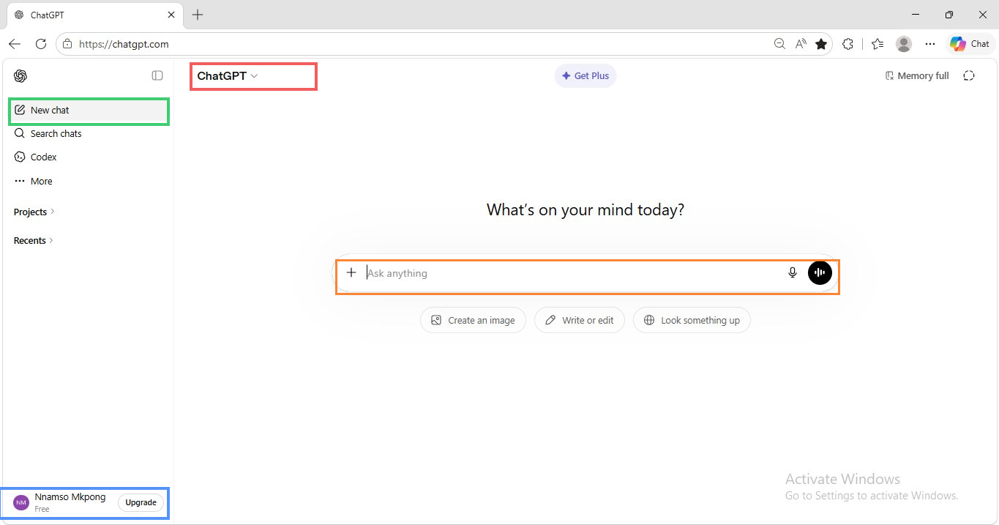
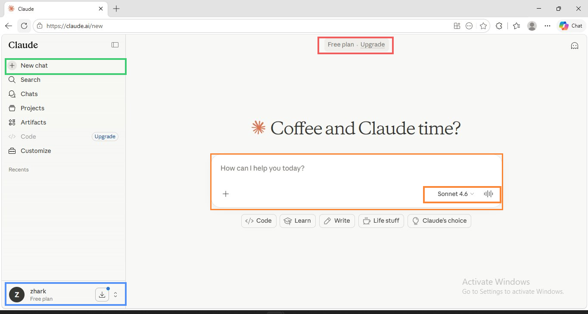
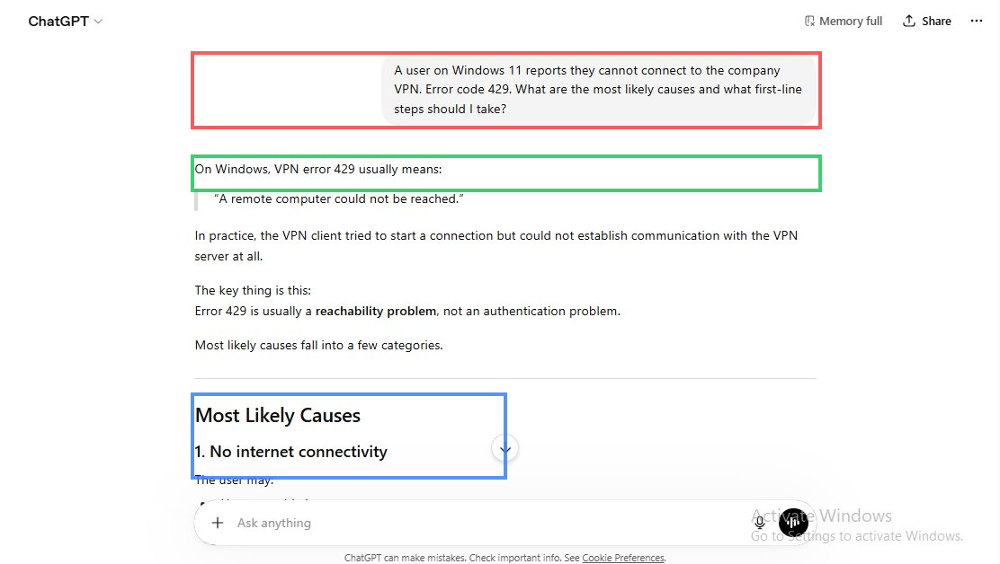
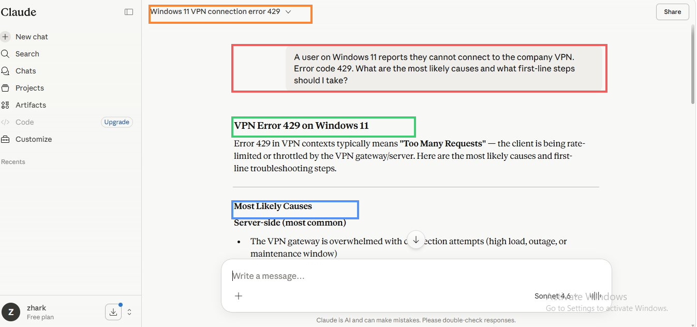
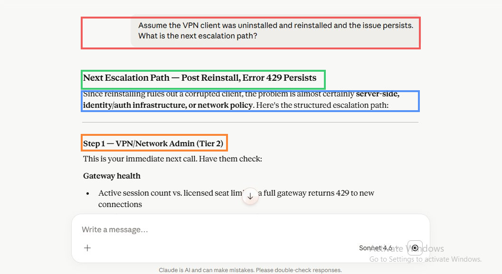
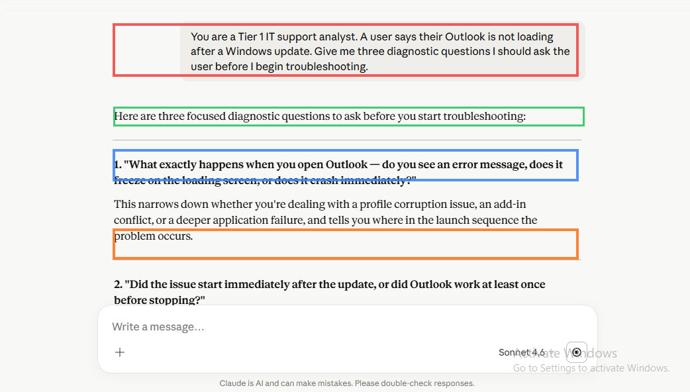
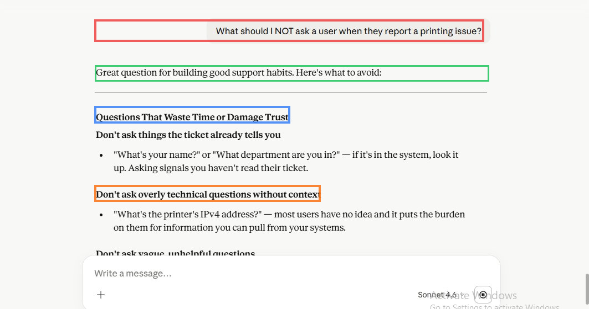
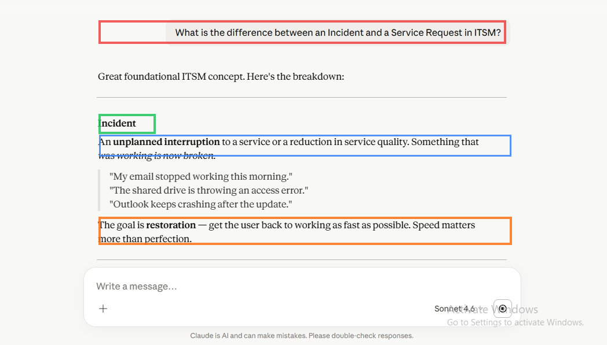

# Set Up AI Tools for IT Support and Write Your First Prompt

> **Author:** Nnamso Mkpong
>
> **Domain:** AI Foundations - Claude.ai and ChatGPT for IT Support
>
> **Environment:** claude.ai (Free plan) and chat.openai.com (Free plan) - Chrome browser
>
> **Completed:** May 2026

---

## Objective

Create accounts on Claude.ai and ChatGPT, explore both interfaces, and write structured IT support prompts that produce useful, actionable answers - demonstrating that you understand how to get value from AI as a working technician, not just a casual user.

---

## Business Scenario

> **New Hire Onboarding Task - Service Desk AI Setup - May 2026**
>
> Your new employer uses AI assistants to help the service desk research faster, draft communications, and generate scripts. Before your first shift, your team lead asks you to set up both tools, run a series of test prompts, and document what each one is best at so the team can use them efficiently.
>
> The goal is not to see if AI can answer questions. The goal is to understand *how* to ask questions as a technician - so you get precise, actionable answers you can use immediately on a live support call, not generic information you still have to interpret.

AI tools are not a replacement for technical knowledge. They are a research multiplier - a way to surface structured troubleshooting steps faster than a search engine, retain context across a conversation, and generate first-draft communications that the analyst then refines. Understanding when to use them and when to go straight to vendor documentation or your team is the skill this lab builds.

---

## Environment and Tools Used

| Component | Detail |
|---|---|
| **AI Tool 1** | Claude.ai - Free plan (Sonnet 4.6 model) |
| **AI Tool 2** | ChatGPT - Free plan (chat.openai.com) |
| **Browser** | Chrome |
| **Account username (Claude)** | zhark |
| **Account name (ChatGPT)** | Nnamso Mkpong |
| **Total prompts tested** | 5 structured IT support prompts across both platforms |
| **Prompt types used** | Diagnostic, follow-up chaining, role prompting, negative scope, conceptual ITSM |

---

## Tool Comparison Table

| Dimension | Claude (Sonnet 4.6) | ChatGPT (Free) |
|---|---|---|
| **Response structure** | Hierarchical headings, bold key terms, numbered steps. Immediately scannable during a live support call. | Also well-structured with headers and numbered steps. Slightly more verbose preamble before reaching actionable content. |
| **Context memory** | Excellent within a conversation. Follow-up prompt on VPN escalation referenced the reinstall from the previous message without needing to repeat it. | Good within a session. Handles follow-up prompts well but occasionally re-introduces context that was already established. |
| **Technical accuracy** | Interpreted VPN error 429 as "Too Many Requests / rate limiting" - a server-side gateway throttle. Correct in a modern VPN gateway context. | Interpreted VPN error 429 as "A remote computer could not be reached" - a Windows-specific RRAS error code. Also correct in a Windows built-in VPN context. Both interpretations are valid; the difference reveals a nuance in the error code's meaning depending on the VPN client. |
| **Role prompting response** | Immediately adopted the Tier 1 analyst persona and produced three focused diagnostic questions with full rationale. Highly usable. | Similar quality when role-prompted. |
| **Response speed** | Fast. Streaming response begins immediately. | Fast. Similar streaming behaviour. |
| **Best use case** | Context-heavy troubleshooting conversations where follow-up prompts build on previous answers. Writing structured communications. ITSM concept explanations. | First-line diagnostic queries, quick lookups, generating checklists. Strong for broad searches with no prior context. |
| **When NOT to use** | Do not use for vendor-specific release notes, licensing queries, or anything requiring a live knowledge base. Go to the vendor portal directly. | Same caveat. ChatGPT knowledge cutoff applies. Do not rely on it for current patch notes or recent CVEs without verification. |

---

## Effective Prompting for IT Support

> **The quality of an AI response is directly proportional to the quality of the prompt. A vague prompt produces a generic answer. A structured prompt with context, role, and scope produces something you can read out on a support call.**

### Role Prompting

Telling the AI what role you or it should play changes the framing of the entire response.

**Without role prompting:**
> "What questions should I ask about an Outlook issue?"

Produces: a general list of questions that could apply to any context.

**With role prompting:**
> "You are a Tier 1 IT support analyst. A user says their Outlook is not loading after a Windows update. Give me three diagnostic questions I should ask the user before I begin troubleshooting."

Produces: three specific, sequenced questions with rationale for why each one matters in the diagnostic flow.

The role instruction acts as a scope constraint. It tells the AI to filter out answers that would be appropriate for a developer, a network architect, or an end user - and give you only what a Tier 1 analyst would actually say on a support call.

### Context Setting

Context is what separates a useful AI response from a generic one. Always give the AI:
- The operating system and version
- The specific error code or symptom
- What has already been tried
- Whether the issue affects one user or many

**Poor prompt:** "VPN not working, how do I fix it?"

**Good prompt:** "A user on Windows 11 reports they cannot connect to the company VPN. Error code 429. What are the most likely causes and what first-line steps should I take?"

The good prompt produces a structured response with categorised causes, numbered steps, and commands you can copy directly into a terminal or ticket note.

### Follow-Up Chaining

AI tools retain conversation context within a session. This means you can build on a previous answer without repeating all the context.

**First prompt:** Ask about VPN error 429.

**Follow-up prompt:** "Assume the VPN client was uninstalled and reinstalled and the issue persists. What is the next escalation path?"

The AI carries the VPN error 429 context forward, knows a reinstall was attempted, and produces a structured escalation path through Tier 2 - VPN/Network Admin, IAM, Network/Firewall, and Endpoint/Security - without needing to be reminded what the original problem was.

This is how you use AI on a live support call: establish the context once, then iterate. Each follow-up narrows the scope and deepens the diagnosis.

### Negative Scope

You can ask AI what *not* to do - and the results are often more immediately useful than asking what to do, because they directly prevent the most common time-wasting mistakes.

**Prompt:** "What should I NOT ask a user when they report a printing issue?"

This produces categories of bad questions: information you can look up yourself (OS, printer model, device record), questions that make the user feel blamed ("Did you do something different?"), vague questions that produce no diagnostic value ("Is it broken?"), and overly technical questions that burden the user with information they do not have.

The underlying rule the AI surfaced: do not ask a question if you can look it up, if the answer is obvious, or if asking it makes the user feel stupid or suspected.

---

## When to Use AI and When Not To

### Use AI When

- **You need a structured starting point fast.** A new error code on a technology you have not worked with before - AI gives you causes and steps in seconds, which you then verify against your organisation's runbooks.
- **You are writing a ticket note or user communication.** AI drafts faster than typing from scratch. You provide the facts; it structures the language.
- **You want diagnostic questions for an unfamiliar symptom.** Role-prompted AI produces the questions a senior analyst would ask, which helps junior technicians avoid missing key diagnostic steps.
- **You need to explain an ITSM concept quickly.** The Incident vs Service Request explanation from this lab is immediately usable in onboarding documentation or team communications.
- **You are in a follow-up chain and need to escalate.** AI can produce a structured escalation summary - with the key data points to hand off to Tier 2 - that you can copy directly into a ticket.

### Do Not Use AI When

- **You need vendor-specific, version-specific documentation.** Microsoft, Cisco, Fortinet, and other vendors publish release notes, known issues, and workarounds that AI may not have or may have outdated. Go to the vendor portal directly.
- **You are troubleshooting a security incident or breach.** AI does not know your environment, your network topology, or your threat landscape. Security incidents require your security team and your SIEM data.
- **You need current CVE or patch information.** Knowledge cutoffs mean AI may not know about a vulnerability disclosed last week. Use your vulnerability management tool or the NVD directly.
- **The answer requires knowing your organisation's specific configuration.** AI does not know your VPN gateway address, your LDAP structure, your firewall rules, or your active SLAs. It gives you the general framework; you apply it to your specific environment.
- **The user is in distress and needs to feel heard.** AI can help you draft what to say, but the opening of a support interaction with a frustrated user requires human empathy and judgement. Do not outsource the first 60 seconds of a difficult call to an AI-generated script.
- **Your company's policy restricts pasting customer data into external tools.** Always check whether your organisation allows the use of cloud AI tools before pasting ticket content, user details, or system information into Claude or ChatGPT.

---

## Steps Performed

---

### Phase 1 - Set Up and Explore ChatGPT

**Step 1.1 - Register at chat.openai.com and Explore the Interface**

Registered a free account at chat.openai.com. Logged in and explored the main interface elements.

> **Green highlight:** The New chat button in the top left of the sidebar. Every new support scenario should start in a fresh conversation to avoid carrying over unrelated context from a previous session.
>
> **Red highlight:** The ChatGPT model label at the top of the conversation area. The free plan provides access to GPT-4o in limited use and GPT-3.5 as the fallback. Knowing which model is active matters because response quality varies between them.
>
> **Blue highlight:** The user account (Nnamso Mkpong, Free plan) in the bottom left. Confirms the account is active and correctly signed in.
>
> **Orange highlight:** The prompt input box - the "Ask anything" field. This is where all prompts are entered. The microphone icon enables voice input. The right-side icons indicate additional capabilities available at the free tier.
>
> Interface elements noted: New chat, Search chats, Codex (coding assistant), Projects, Recents, and the prompt shortcut buttons (Create an image, Write or edit, Look something up). The "Memory full" indicator at the top right shows that ChatGPT's persistent memory feature is active for this account.

---

### Phase 2 - Set Up and Explore Claude

**Step 2.1 - Register at claude.ai and Explore the Interface**

Registered a free account at claude.ai. Logged in and explored the interface.

> **Green highlight:** The New chat button in the top left of the sidebar. Same function as ChatGPT - starts a fresh context-free conversation.
>
> **Red highlight:** The Free plan - Upgrade indicator at the top of the conversation area. The free plan provides access to Claude Sonnet 4.6. The model selector in the prompt box shows the current model.
>
> **Blue highlight:** The user account (zhark, Free plan) in the bottom left. Confirms the account is active.
>
> **Orange highlight (outer):** The prompt input box. The model selector (Sonnet 4.6) is visible in the bottom right of the input area - this is where the model can be changed if multiple are available.
>
> Interface elements noted: New chat, Search, Chats, Projects, Artifacts, Code (Upgrade required), Customize, and Recents. The category buttons below the main prompt (Code, Learn, Write, Life stuff, Claude's choice) are quick-start suggestions. The Artifacts panel (right side on wider screens) renders code, documents, and structured content separately from the conversation.

---

### Phase 3 - First Structured Prompt in ChatGPT

**Step 3.1 - Send the VPN Error 429 Diagnostic Prompt to ChatGPT**

Sent the first structured IT support prompt to ChatGPT and reviewed the response.

**Prompt:** A user on Windows 11 reports they cannot connect to the company VPN. Error code 429. What are the most likely causes and what first-line steps should I take?

> **Red highlight:** The user prompt bubble at the top showing the exact text of the structured prompt. The specificity of the prompt - Windows 11, VPN, error code 429 - is what produces a structured response rather than a generic "try restarting" answer.
>
> **Green highlight:** The first line of ChatGPT's response establishing the interpretation of error 429 as "A remote computer could not be reached" - a Windows RRAS-specific meaning. This is the framing assumption that shapes all subsequent troubleshooting steps.
>
> **Blue highlight:** The "Most Likely Causes" section heading. ChatGPT's response uses bold numbered headings for causes and a separate numbered list for troubleshooting steps, making it scannable during a live call.
>
> ChatGPT's interpretation of error 429 as a reachability problem (rather than a rate-limiting problem as Claude interpreted it) is technically valid. Windows built-in VPN client uses error 429 to indicate the remote computer could not be reached. This distinction - same error code, different client context - is a useful calibration point for understanding AI response nuance. See the prompts log for full response evaluation.

---

### Phase 4 - Same Prompt in Claude - Direct Comparison

**Step 4.1 - Send the Identical VPN Prompt to Claude and Compare Responses**

Sent the same VPN error 429 prompt to Claude.ai and compared the response to ChatGPT's.

> **Red highlight:** The user prompt bubble containing the identical prompt text. Running the same prompt in both tools on the same day is the correct method for a direct comparison - any difference in response is attributable to the model, not to variation in the question.
>
> **Orange highlight:** The conversation title bar showing "Windows 11 VPN connection error 429" - Claude automatically generates a conversation title from the first prompt. This makes navigating back to a specific conversation easy from the Chats sidebar.
>
> **Green highlight:** Claude's response heading "VPN Error 429 on Windows 11" followed immediately by the interpretation: error 429 in VPN contexts typically means "Too Many Requests" - the client is being rate-limited by the VPN gateway. This is a different interpretation from ChatGPT and reflects a modern VPN gateway (Cisco ASA, Palo Alto GlobalProtect, Fortinet) context where 429 is an HTTP-style rate-limiting response.
>
> **Blue highlight:** The "Most Likely Causes" section. Claude categorises causes as Server-side, Client-side, and Network/infrastructure - a three-tier framework that immediately maps to the escalation path. ChatGPT categorised causes by type of problem. Both approaches are useful; Claude's is slightly more immediately actionable for escalation routing.

---

### Phase 5 - Follow-Up Chaining - Context Retention Test

**Step 5.1 - Send the Escalation Follow-Up Prompt Without Repeating Context**

Within the same Claude conversation (no new chat), sent the follow-up prompt to test context retention.

**Prompt:** Assume the VPN client was uninstalled and reinstalled and the issue persists. What is the next escalation path?

> **Red highlight:** The follow-up prompt bubble. Note that the prompt does not restate any context - no mention of Windows 11, no mention of error 429, no mention of the user. Claude carries all of that forward from the previous message.
>
> **Green highlight:** The response heading "Next Escalation Path - Post Reinstall, Error 429 Persists". Claude referenced the reinstall from the new prompt and the error code from the previous message simultaneously - demonstrating genuine context retention across the conversation.
>
> **Blue highlight:** The key deduction in Claude's response: "Since reinstalling rules out a corrupted client, the problem is almost certainly server-side, identity/auth infrastructure, or network policy." This is a logical inference built on the combination of the previous context (error 429) and the new information (reinstall did not help). A search engine cannot do this.
>
> **Orange highlight:** "Step 1 - VPN/Network Admin (Tier 2)" - the structured four-step escalation path that follows. Each step names the team, what they should check, and what evidence to hand off. This is a complete escalation brief that can be copied directly into a P2 incident ticket.

---

### Phase 6 - Role Prompting Technique

**Step 6.1 - Send a Role-Instructed Prompt to Demonstrate Persona Shaping**

Sent a role-prompting example to demonstrate how a role instruction shapes the AI's response format and focus.

**Prompt:** You are a Tier 1 IT support analyst. A user says their Outlook is not loading after a Windows update. Give me three diagnostic questions I should ask the user before I begin troubleshooting.

> **Red highlight:** The full role prompt bubble. Three components working together: role instruction ("You are a Tier 1 IT support analyst"), scenario context ("Outlook not loading after Windows update"), and specific output format ("three diagnostic questions I should ask").
>
> **Green highlight:** Claude's response opener confirming it adopted the role: "Here are three focused diagnostic questions to ask before you start troubleshooting." The word "focused" signals that the role instruction successfully narrowed the scope.
>
> **Blue highlight:** Question 1 in bold: "What exactly happens when you open Outlook - do you see an error message, does it freeze on the loading screen, or does it crash immediately?" This is exactly the question a senior Tier 1 analyst would ask to scope whether the problem is a profile, add-in, or application failure.
>
> **Orange highlight:** Question 2 in bold: "Did the issue start immediately after the update, or did Outlook work at least once before stopping?" This question is the diagnostic key - the answer determines whether this is a compatibility break or a post-update cache/process issue. Without the role instruction, the AI might have jumped straight to troubleshooting steps rather than the diagnostic questions that a technician needs first.

---

### Phase 7 - Negative Scope Prompting

**Step 7.1 - Ask What NOT to Do When a User Reports a Printing Issue**

Sent a negative scope prompt to demonstrate that AI can help you avoid common support mistakes, not just perform correct actions.

**Prompt:** What should I NOT ask a user when they report a printing issue?

> **Red highlight:** The negative scope prompt - phrased as "what should I NOT ask". This inverts the usual troubleshooting question and produces a list of anti-patterns rather than a list of best practices. Both are useful; the anti-patterns list is often more immediately practical because it prevents the specific mistakes new analysts make.
>
> **Green highlight:** Claude's response opener: "Great question for building good support habits. Here's what to avoid." The framing as habit-building is appropriate - negative scope prompts are most valuable during onboarding and peer review.
>
> **Blue highlight:** The first category heading "Questions That Waste Time or Damage Trust" and the first sub-category "Don't ask things the ticket already tells you." This directly addresses one of the most common new-analyst mistakes: asking the user their name or department when it is in the ticket system.
>
> **Orange highlight:** The second sub-category: "Don't ask overly technical questions without context." The example - asking a user for the printer's IPv4 address - is a real mistake that both wastes the user's time and signals that the analyst is not using their available tools.
>
> The underlying rule Claude surfaced at the end of the response: "Don't ask a question if you can look it up, if the answer is obvious, or if asking it makes the user feel stupid or suspected." This single sentence is a principle worth memorising.

---

### Phase 8 - ITSM Conceptual Query

**Step 8.1 - Ask Claude to Explain Incident vs Service Request**

Sent a foundational ITSM concept question to demonstrate how AI can be used to explain and reinforce theoretical knowledge.

**Prompt:** What is the difference between an Incident and a Service Request in ITSM?

> **Red highlight:** The conceptual prompt. No scenario context needed here - this is a pure knowledge question about ITSM terminology. Comparing the AI's answer to the ServiceNow and Jira lab content validates whether the definition is consistent across sources.
>
> **Green highlight:** The "Incident" bold heading. Claude's definition: "An unplanned interruption to a service or a reduction in service quality. Something that was working is now broken." This matches the ITIL definition exactly and is more concise than most vendor documentation.
>
> **Blue highlight:** "An unplanned interruption to a service or a reduction in service quality." This is the precise ITIL language that should appear in ticket categorisation decisions.
>
> **Orange highlight:** "The goal is restoration - get the user back to working as fast as possible. Speed matters more than perfection." This is the operational implication - the reason incident SLAs are measured in hours and service request SLAs in days. A technician who understands this does not apply the same urgency to a software install request as to a downed shared drive. Claude's response also covered the grey area: password resets and VPN reinstall requests that appear to be service requests but may be incidents depending on the underlying cause.

---

## Before and After Comparison

### Before - No AI Tools, Slower Research Cycle

| What the team did | Time cost |
|---|---|
| Search Google for an error code and sift through forum posts | 5-15 minutes per unfamiliar error |
| Write ticket notes from scratch during the call | 2-3 minutes per ticket |
| Ask a senior analyst for diagnostic questions | Blocked until senior is available |
| Look up ITSM definitions in training documentation | 5+ minutes per concept |

### After - AI Tools Integrated into the Support Workflow

| What AI enables | Time saved |
|---|---|
| Structured causes and first-line steps for any error code | Under 30 seconds |
| Follow-up escalation path without losing context | Immediate, no context re-entry |
| Diagnostic questions framed for the correct tier | Instant, role-prompted |
| Ticket note draft from bullet points | Under 60 seconds |
| ITSM concept explanation with examples | Immediate |

---

## Outcome and Validation

| Check | Result |
|---|---|
| Active account on ChatGPT (chat.openai.com) | Pass - Nnamso Mkpong, Free plan |
| Active account on Claude (claude.ai) | Pass - zhark, Free plan, Sonnet 4.6 |
| Both interfaces explored and elements identified | Pass |
| VPN error 429 prompt sent to both tools | Pass |
| Responses compared for detail, accuracy, and format | Pass - documented in comparison table and prompts-log.md |
| Follow-up prompt sent in Claude to test context retention | Pass - context carried forward correctly |
| Role prompting technique demonstrated | Pass - Tier 1 analyst persona adopted |
| Negative scope prompting demonstrated | Pass - printing anti-patterns produced |
| ITSM conceptual query sent and verified against existing knowledge | Pass - consistent with ITIL definition |
| Comparison table written in README | Pass |
| Effective Prompting section written | Pass |
| When to Use AI / When Not To section written | Pass |
| prompts-log.md created with all prompts and evaluations | Pass |
| Five or more documented prompt and response pairs | Pass - 5 prompts, 2 platforms |

---

## What I Learned

1. **The same error code can mean different things in different contexts.** VPN error 429 on Windows built-in VPN client means "remote computer could not be reached" (ChatGPT's interpretation). On a modern VPN gateway (Cisco, Palo Alto, Fortinet), 429 is an HTTP-style rate-limiting response meaning "too many requests." Both are correct in their context. This distinction only emerged because the same prompt was sent to two different AI tools with different training emphasis. The lesson: always contextualise an error code against the specific client and gateway, not just the number.

2. **Context retention is the most powerful feature of a conversation-based AI.** The follow-up escalation prompt did not need to re-establish any context. Claude knew the error code, knew a reinstall had been attempted, and produced a four-step escalation path that built on both pieces of information. This is the difference between AI as a search engine (stateless, one query at a time) and AI as a collaborative diagnostic session (stateful, context-accumulating).

3. **Role instructions are the fastest way to get output formatted for your specific use case.** "You are a Tier 1 IT support analyst" is a three-second addition to any prompt. The output it produces is calibrated for a specific audience, a specific level of technical depth, and a specific operational context. Without the role instruction, the same question produces a generic answer that requires interpretation. With it, the output is ready to use on a call.

4. **Negative scope prompts are underused and highly practical.** Asking what NOT to do produces a more immediately actionable checklist for a new analyst than asking what to do. The bad questions list for a printing issue is something that can be printed and used as a peer review tool during team coaching sessions.

5. **AI explanation of ITSM concepts is consistent with official ITIL definitions and adds operational context.** Claude's explanation of Incident vs Service Request matched the ITIL source definition and added the grey area examples (password resets, VPN reinstalls) that training documentation often omits. This makes AI a useful tool for reinforcing theoretical knowledge during self-study.

6. **Knowing when NOT to use AI is as important as knowing how to use it.** Current CVE data, vendor-specific patch notes, organisation-specific configurations, and security incident investigation all require sources that AI cannot reliably provide. A technician who asks AI about a vulnerability disclosed last week and acts on a potentially outdated answer is making a risk-management error, not a research error.

7. **AI tools have different strengths based on how they interpret the same prompt.** ChatGPT's Windows-specific interpretation of error 429 is more useful when the user is running the Windows built-in VPN client. Claude's rate-limiting interpretation is more useful when the organisation uses a third-party VPN gateway. The correct tool depends on the specific scenario - which means knowing both is better than committing to one.

---

## Real World Relevance

In a real service desk environment, the technicians who get the fastest resolution times are not necessarily the ones with the most technical knowledge. They are the ones who have the best research and communication workflows. AI tools, used correctly, are a research and communication accelerator.

The prompts demonstrated in this lab represent the five core use cases that provide the most value on a live support shift:

1. **Error code lookup with context** - faster than Google, structured for immediate use
2. **Escalation path generation** - builds on diagnostic context already established
3. **Diagnostic question generation** - role-prompted for the correct analyst tier
4. **Anti-pattern identification** - prevents time-wasting in user interactions
5. **Concept explanation with operational implications** - faster than documentation, includes grey areas

The comparison table and prompts log in this lab are living documents. Every new prompt that produces a useful result should be added to the log. Over time, the log becomes a team resource - a library of tested, evaluated prompts that any analyst can use, adapt, and build on.

---

## Troubleshooting Reference

| Situation | Correct Action | Common Mistake |
|---|---|---|
| AI gives a generic answer with no specific steps | Add context: OS version, exact error code, what has already been tried, whether one user or many are affected | Sending a single-sentence prompt and expecting a detailed diagnostic response |
| AI response contradicts vendor documentation | Trust the vendor documentation. AI training data has a knowledge cutoff and may reflect an older version of the product. Use AI for the framework and vendor docs for the specific version detail | Acting on AI output without cross-referencing against the vendor knowledge base for anything version-specific |
| Follow-up prompt loses context from the previous message | Check you are still in the same conversation, not a new chat. If context was lost, re-paste the relevant prior details at the top of the follow-up prompt | Starting a new chat for each follow-up, losing all accumulated context and having to re-establish it from scratch |
| AI refuses to answer a question | Rephrase the prompt to be more clearly professional and specific. Add "for IT support purposes" or "in a corporate environment" to clarify the professional context | Abandoning the query rather than rephrasing it with clearer professional context |
| Company policy is unclear on using cloud AI tools with ticket data | Ask your manager or security team before pasting any customer data, user PII, or internal system details into an external AI tool | Assuming that because the tool is free and web-based it is approved for all use cases |
| AI provides an escalation path that does not match your organisation's structure | Use the AI output as the framework and adapt it to your actual team structure. The four-step escalation path (VPN Admin, IAM, Network/Firewall, Endpoint) is a model - your organisation may combine some of these teams | Following the AI escalation path literally without mapping it to your actual org chart |
