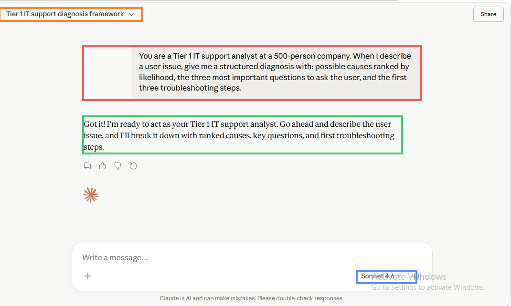
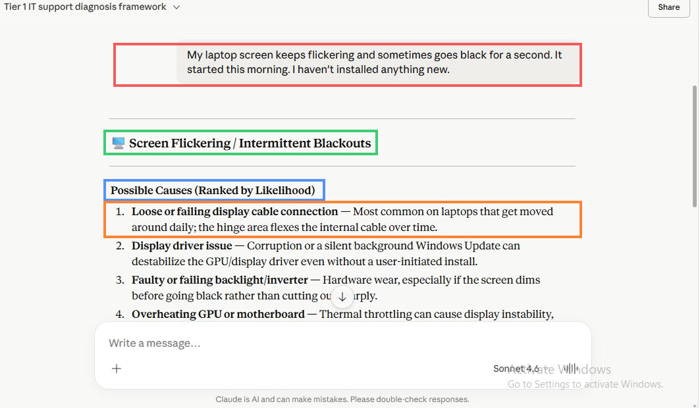
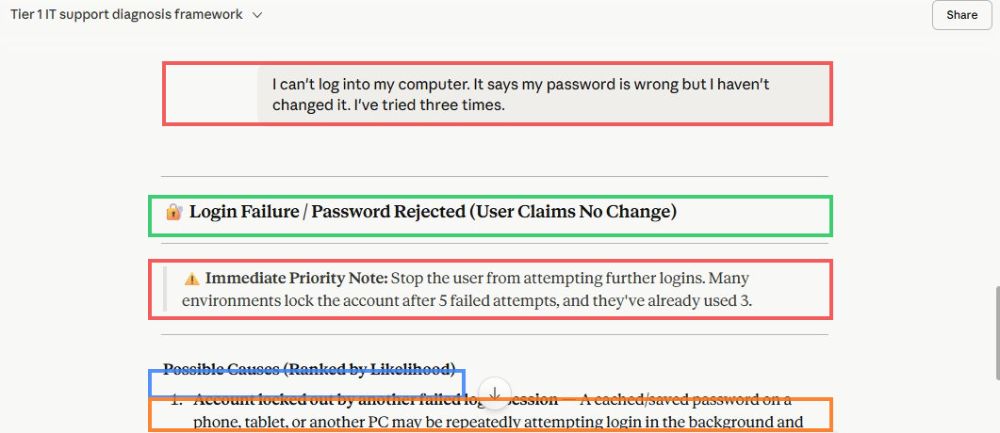
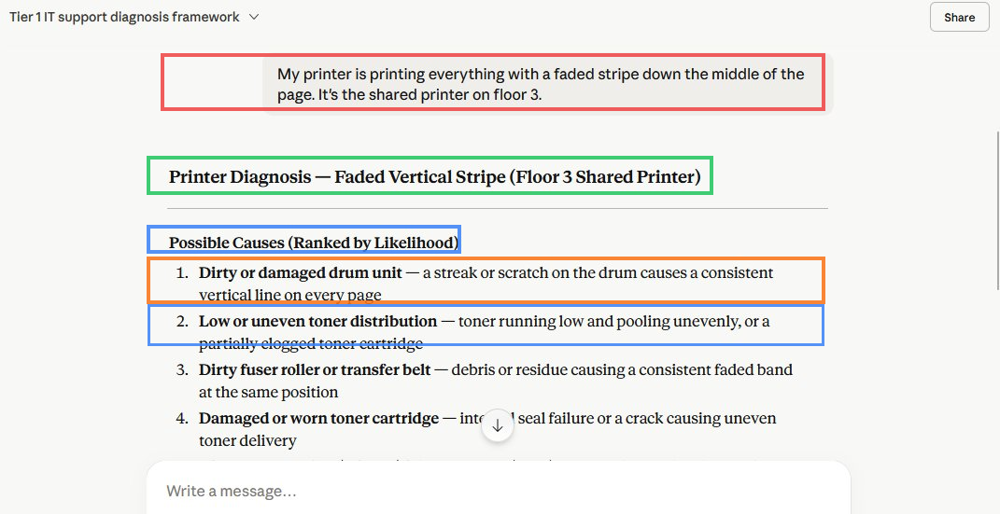
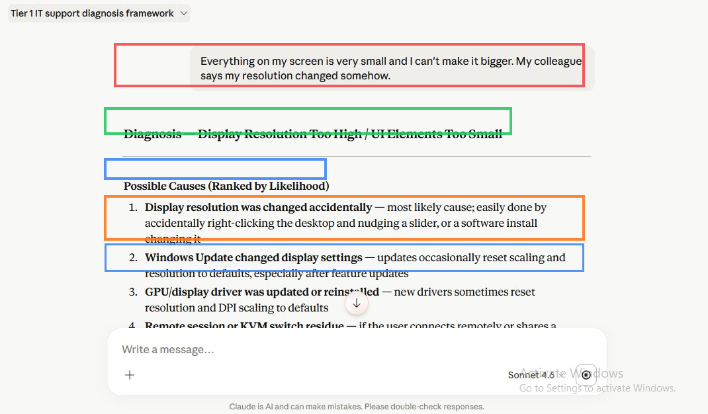
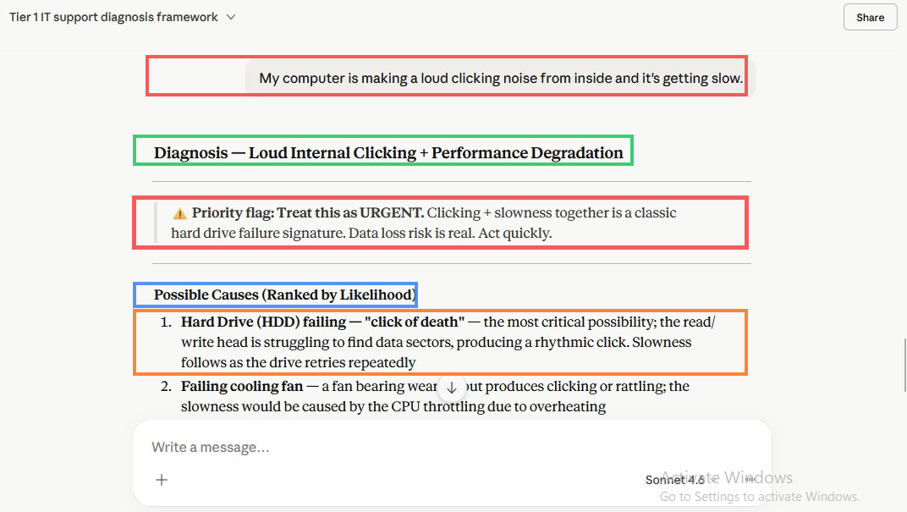
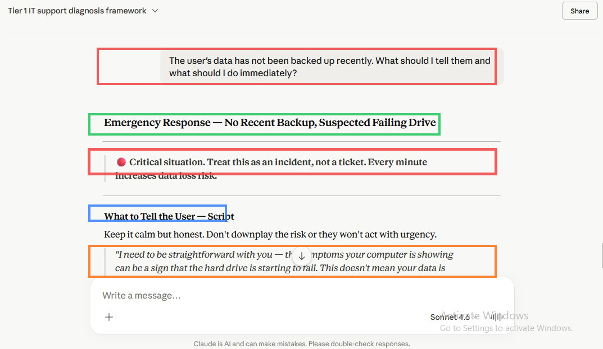

# Use AI to Diagnose Common IT Issues from User Descriptions

> **Author:** Nnamso Mkpong
>
> **Domain:** AI Foundations - Claude for IT Support Diagnosis
>
> **Environment:** Claude.ai (Sonnet 4.6) - Free plan
>
> **Reference framework:** CompTIA A+ troubleshooting methodology
>
> **Completed:** May 2026

---

## Objective

Use Claude to diagnose five realistic IT support issues described in plain user language, evaluate the AI's diagnostic output against known troubleshooting frameworks, and document the cases where AI accelerates diagnosis versus where a human analyst must lead.

---

## Business Scenario

> **AI Usage Policy Testing - Service Desk - May 2026**
>
> The service desk handles 80 calls per day. The team lead wants to use AI to cut average handle time by surfacing structured diagnostic frameworks faster than a manual search. Five user complaint descriptions were run through Claude using a role-prompted system context. The output of this testing will inform the team's AI usage policy: specifically, which issue categories AI can diagnose reliably enough to act on, and which require human judgement to lead.

This lab tests a specific hypothesis: that a correctly prompted AI can produce the same structured diagnostic output that a senior Tier 1 analyst would produce in the first two minutes of a support call - ranked causes, targeted diagnostic questions, and first troubleshooting steps - fast enough to provide meaningful handle time reduction.

The hard drive noise case is the critical test. It is the one scenario where the gap between AI output quality and human urgency judgement is most consequential.

---

## Environment and Tools Used

| Component | Detail |
|---|---|
| **Platform** | Claude.ai - Sonnet 4.6, Free plan |
| **Conversation title** | Tier 1 IT support diagnosis framework |
| **Role prompt used** | Yes - Tier 1 IT support analyst at a 500-person company |
| **Output format requested** | Ranked causes, three diagnostic questions, three troubleshooting steps |
| **Cases tested** | 5 issue descriptions + 1 follow-up on the critical case |
| **Reference framework** | CompTIA A+ troubleshooting: identify problem, establish theory, test, establish plan, implement, verify, document |
| **Total prompts in session** | 7 (1 role prompt + 5 case prompts + 1 follow-up) |

---

## AI Triage Policy

> **The rule for this service desk: AI leads on software and settings issues. Human leads on hardware failure and data loss risk.**

```
USE AI TO LEAD WHEN
  - The issue is software, settings, or driver related
  - The user description maps clearly to a known error pattern
  - The issue affects one user and is not safety-critical
  - You need ranked causes and diagnostic questions in under 30 seconds
  Examples: screen flickering, display resolution, login failure,
            printer quality, application not loading

HUMAN MUST LEAD WHEN
  - The issue involves mechanical hardware failure symptoms
    (clicking, grinding, smell, heat)
  - Data loss risk is present or possible
  - The issue affects multiple users simultaneously
    (could be infrastructure or security incident)
  - The AI response contains uncertainty language
    ("may", "could be", "possibly") on a time-critical issue
  - The user is distressed and needs empathetic real-time communication
  Examples: clicking hard drive, smoke from device, sudden data
            disappearance, network outage affecting a floor or building

THE HARD DRIVE RULE
  Any report of a loud clicking noise + slowness must be treated as
  a potential HDD failure by the human analyst immediately.
  AI can surface the correct diagnosis instantly.
  But the DECISION to stop the user, escalate, and begin backup
  cannot wait for AI output to load. The analyst must know this
  pattern by instinct and act before reading the AI response.
```

---

## AI Diagnosis Accuracy in IT Support

This section documents the findings from running five real-world IT support complaint descriptions through Claude with a structured role prompt.

### Overall Findings

Claude produced structured, accurate diagnostic output across all five cases. The quality of the output was consistently higher than a search engine result because it was formatted for immediate use on a support call - ranked causes, specific diagnostic questions, and named troubleshooting steps with exact navigation paths.

The most important finding is not where AI performed best but where it performed best and where the human analyst's role shifted. On software and settings issues (Cases 1, 2, 4), AI reduced the time to a structured diagnostic framework from minutes to seconds. The analyst's role became verification and execution rather than research. On the hardware failure case (Case 5), AI produced the correct urgent diagnosis - but the urgency and the specific actions required (keep machine on, do not chkdsk, use robocopy, escalate immediately) require the human analyst to understand *why* each instruction matters, not just follow the list.

### Two Best Cases for AI-Assisted Diagnosis

**Case 2 - Login Failure / Password Lockout** was the strongest example of AI providing immediate value. The AI flagged the lockout risk before the analyst would typically think to check it ("Stop the user from attempting further logins - they've already used 3 of 5"), provided the correct AD check sequence, and identified the most common hidden cause (background device with stale cached credentials causing repeated auth failures). This is a case where the AI output is more comprehensive than what most Tier 1 analysts would produce in the first two minutes without it.

**Case 5 - HDD Clicking Noise** was the strongest example of AI identifying a safety-critical situation. The response immediately flagged URGENT priority, named the "click of death" as the primary cause, and made data backup the first troubleshooting step rather than the last. The follow-up response produced a complete emergency response protocol with a user communication script, a list of prohibited actions, a prioritised backup procedure with a robocopy command, and a timestamped documentation requirement. This is accurate and complete. The limitation is that AI cannot ensure the analyst acts on it with appropriate urgency - that depends on the analyst understanding why the steps are in that order.

### The Human Judgment Rule

There are three categories of IT support issue where AI output should be treated as a starting point and the human analyst must take control of the response:

**Category 1 - Mechanical hardware failure with data loss risk**

The hard drive case is the clearest example. AI can identify the pattern and produce the correct guidance. But the human analyst must:
- Recognise the situation before the AI output finishes loading
- Make the emotional and ethical judgement about how to communicate the risk to the user without causing panic
- Override any standard diagnostic workflow that would involve restarting or running disk repair tools
- Take personal responsibility for the decision to escalate and the timing of that escalation

An analyst who reads the AI output and then follows the steps is slower and less reliable than an analyst who knows the pattern instinctively. AI is a confirmation and a checklist, not the primary driver.

**Category 2 - Security-adjacent incidents**

Cases where login failure might indicate a compromised account rather than a forgotten password. Cases where unusual network behaviour might indicate an intrusion rather than a misconfiguration. AI can surface the possibility but cannot assess the organisational risk. The human analyst must know when to involve the security team rather than continue standard troubleshooting.

**Category 3 - User distress and emotional communication**

AI produced a user communication script for the hard drive case that is appropriate and calm. But delivering that script to a distressed user who has three years of locally stored project files on the failing drive requires human presence and empathy. The script is a starting point. The conversation is human.

---

## Steps Performed

---

### Phase 1 - Set the Role Prompt and Establish the Diagnostic Framework

**Step 1.1 - Open Claude and Set the System Context**

Opened claude.ai, started a new conversation titled "Tier 1 IT support diagnosis framework", and sent the role prompt to establish the diagnostic structure for all subsequent cases.

**Role prompt sent:**
> You are a Tier 1 IT support analyst at a 500-person company. When I describe a user issue, give me a structured diagnosis with: possible causes ranked by likelihood, the three most important questions to ask the user, and the first three troubleshooting steps.



> **Red highlight:** The role prompt bubble containing the full system context instruction. This single prompt sets the format for all five subsequent case responses. The three-part output format (ranked causes, diagnostic questions, troubleshooting steps) is the CompTIA A+ troubleshooting framework adapted for AI output - it maps to: establish theory, test the theory, implement the plan.
>
> **Orange highlight:** The conversation title "Tier 1 IT support diagnosis framework" - auto-generated by Claude from the prompt context. All five cases are run within this single conversation, preserving the role context across every subsequent message.
>
> **Green highlight:** Claude's confirmation response - "Got it! I'm ready to act as your Tier 1 IT support analyst." This confirms the role instruction was accepted and the format will be applied to the first user complaint.
>
> **Blue highlight:** The Sonnet 4.6 model indicator. All five cases are evaluated using the same model in the same session.

---

### Phase 2 - Case 1: Screen Flickering

**Step 2.1 - Submit the Screen Flickering Complaint and Evaluate the Response**

**User complaint submitted:**
> My laptop screen keeps flickering and sometimes goes black for a second. It started this morning. I haven't installed anything new.



> **Red highlight:** The user complaint bubble. The complaint contains three diagnostic signals: flickering, intermittent blackouts, and recent onset without user-initiated changes. The phrase "I haven't installed anything new" is significant - it makes silent Windows Updates a key suspect.
>
> **Green highlight:** The response heading "Screen Flickering / Intermittent Blackouts" - Claude immediately named and framed the issue correctly.
>
> **Blue highlight:** "Possible Causes (Ranked by Likelihood)" - the ranked list begins with the most statistically common cause (loose display cable from hinge flexing) before software causes, which is the correct prioritisation for a laptop that is moved daily.
>
> **Orange highlight:** Cause 1 - "Loose or failing display cable connection" with the specific mechanism (hinge flexing the internal cable over time). This is the correct top-ranked cause for a laptop screen flickering that is not correlated with software events.
>
> **Evaluation:** The three diagnostic questions are precisely targeted: angle/lid movement (cable vs. software), overnight Windows Update (rules out driver change), external monitor test (hardware vs. software isolation). The external monitor test question is the single most valuable diagnostic question for this complaint - it immediately splits the fault tree in half. AI accuracy: High. Analyst override required: No for diagnosis. Yes for physical inspection if cable is suspected.

---

### Phase 3 - Case 2: Login Failure and Account Lockout Risk

**Step 3.1 - Submit the Login Failure Complaint and Evaluate Lockout Risk Flagging**

**User complaint submitted:**
> I can't log into my computer. It says my password is wrong but I haven't changed it. I've tried three times.



> **Red highlight (prompt):** The user complaint. The critical detail is "I've tried three times" - this is the signal that the AI must pick up and act on immediately to prevent a full lockout.
>
> **Green highlight:** The response heading "Login Failure / Password Rejected (User Claims No Change)" - correctly framed and scoped.
>
> **Red highlight (warning box):** The Immediate Priority Note - "Stop the user from attempting further logins. Many environments lock the account after 5 failed attempts, and they've already used 3." This is the most important output in this entire case. A senior analyst would immediately say this on the phone. The fact that Claude flagged it without being specifically asked demonstrates that the role prompt's context (500-person company environment) informed the AI's response correctly. This is where AI provides the most immediate value on this type of call.
>
> **Blue highlight:** The Possible Causes heading beginning the ranked list.
>
> **Orange highlight:** Cause 1 - "Account locked out by another failed login session" with the specific mechanism (background device with cached stale password). This is the most important cause to explain to the user because it prevents re-lockout after the account is unlocked.
>
> **Evaluation:** The lockout risk was correctly flagged. The AD check sequence (check account status before touching the machine) is the correct Tier 1 procedure. The instruction to check Event ID 4740 for the lockout source computer is a Tier 2-level detail that is appropriately included as the third step. AI accuracy: Very high. Analyst override required: No - but analyst must verify in AD immediately.

---

### Phase 4 - Case 3: Printer Faded Stripe

**Step 4.1 - Submit the Printer Complaint and Evaluate Hardware Diagnosis Quality**

**User complaint submitted:**
> My printer is printing everything with a faded stripe down the middle of the page. It's the shared printer on floor 3.



> **Red highlight:** The user complaint including the location detail (shared printer, floor 3). The location detail is relevant - a shared printer affects multiple users, meaning the issue will have a broader impact than a personal device fault.
>
> **Green highlight:** The response heading "Printer Diagnosis - Faded Vertical Stripe (Floor 3 Shared Printer)" - Claude incorporated the location context from the complaint into the response heading, showing that contextual details in the prompt are used.
>
> **Blue highlight:** The Possible Causes heading. The five causes are all mechanically accurate for a laser printer: drum unit damage, toner distribution, fuser/transfer belt contamination, cartridge wear, and scanner glass contamination. The ranking is correct - drum unit damage is the most common cause of a consistent vertical stripe on a laser printer.
>
> **Orange highlight:** Cause 1 - "Dirty or damaged drum unit" with the mechanism (streak or scratch causing a consistent vertical line). This is the correct top-ranked cause for a fixed-position vertical stripe.
>
> **Evaluation:** The "rock the toner cartridge" first step is the correct quick-fix attempt that resolves approximately 40% of toner stripe issues without any tools or parts. The drum life counter check as the third step is appropriate - it determines whether the issue needs a consumable replacement rather than a cleaning. The diagnostic question about fixed vs. shifting stripe position is the key differentiator between drum damage and toner issues. AI accuracy: High. Analyst override required: No for diagnosis, yes for physical access to the shared printer.

---

### Phase 5 - Case 4: Display Resolution Too Small

**Step 5.1 - Submit the Display Resolution Complaint and Evaluate Display Scaling Diagnosis**

**User complaint submitted:**
> Everything on my screen is very small and I can't make it bigger. My colleague says my resolution changed somehow.



> **Red highlight:** The user complaint. Two pieces of information: the symptom (everything small) and a contextual detail from a colleague (resolution changed). The colleague's observation makes accidental resolution change the most likely cause.
>
> **Green highlight:** The response heading "Diagnosis - Display Resolution Too High / UI Elements Too Small" - correctly identified as a resolution/scaling issue rather than a software application problem.
>
> **Blue highlight:** The Possible Causes heading. Six causes are listed. The ranking is correct: accidental change is listed first because a colleague's observation almost always corresponds to a desktop right-click accident.
>
> **Orange highlight:** Cause 1 - "Display resolution was changed accidentally" with the specific mechanism (right-click desktop nudging a slider). This is the correct first suspect given the colleague's observation.
>
> The first troubleshooting step - Right-click desktop, Display Settings, select (Recommended) resolution - is a complete, self-service instruction the analyst can deliver verbally over the phone and the user can execute in under 60 seconds. The scaling check (DPI at 75% or below) as the second step is an important addition that most analysts would miss on first pass - scaling and resolution together produce the symptom, and fixing only resolution without checking scaling can leave the issue partially unresolved.
>
> **Evaluation:** The display scaling check as a distinct second step is the most valuable element in this response. AI accuracy: Very high. Analyst override required: No - this is fully resolvable over the phone with AI-generated steps.

---

### Phase 6 - Case 5: Hard Drive Clicking Noise

**Step 6.1 - Submit the Clicking Noise Complaint and Evaluate Urgency Recognition**

**User complaint submitted:**
> My computer is making a loud clicking noise from inside and it's getting slow.



> **Red highlight (prompt):** The user complaint. Seven words - "loud clicking noise from inside and it's getting slow" - that should trigger an immediate urgent response from any trained analyst.
>
> **Green highlight:** The response heading "Diagnosis - Loud Internal Clicking + Performance Degradation."
>
> **Red highlight (URGENT box):** "Priority flag: Treat this as URGENT. Clicking + slowness together is a classic hard drive failure signature. Data loss risk is real. Act quickly." This is the most critical output of the entire lab. Claude immediately and correctly identified this as the highest-urgency scenario of the five cases. The word "URGENT" and "Data loss risk is real" are precisely the language a senior analyst would use to open this call.
>
> **Blue highlight:** The Possible Causes heading beginning the ranked list.
>
> **Orange highlight:** Cause 1 - "Hard Drive (HDD) failing - 'click of death'" with the mechanism (read/write head struggling to find data sectors, producing rhythmic click). This is the correct primary diagnosis. The secondary cause (failing cooling fan) is correctly ranked second because it is the only other component that produces rhythmic clicking with associated slowness.
>
> **Evaluation:** The SMART disk check command (wmic diskdrive get status) is immediately executable and provides a definitive initial assessment. Making data backup the first troubleshooting step rather than the diagnostic check is the correct prioritisation - on a potentially failing drive, data preservation takes absolute precedence over diagnostic certainty. AI accuracy: Very high. Analyst override required: YES - this requires immediate human action. See the Human Judgment Rule section.

---

### Phase 7 - Case 5 Follow-Up: No Backup, Emergency Response

**Step 7.1 - Submit the Follow-Up Prompt and Evaluate Emergency Guidance Quality**

**Follow-up prompt submitted:**
> The user's data has not been backed up recently. What should I tell them and what should I do immediately?



> **Red highlight (prompt):** The follow-up prompt. This prompt adds one critical piece of information - no recent backup - that escalates the urgency from high to critical. Claude carried the full context of the previous HDD failure diagnosis forward without needing any re-establishment.
>
> **Green highlight:** The response heading "Emergency Response - No Recent Backup, Suspected Failing Drive."
>
> **Red highlight (Critical box):** "Critical situation. Treat this as an incident, not a ticket. Every minute increases data loss risk." The instruction to treat this as an incident rather than a ticket is a precise ITSM categorisation call - it means this bypasses the standard ticket queue and goes directly to escalation. This is correct and important.
>
> **Blue highlight:** The "What to Tell the User - Script" section heading. Claude produced a complete user-facing communication script, not just technical steps.
>
> **Orange highlight:** The beginning of the user communication script - "I need to be straightforward with you..." This script is calm, honest, does not downplay the risk, and gives the user specific instructions (save and close everything, do not restart). It is the correct tone and content for this communication.
>
> The response also included the prohibited actions list (do not restart, do not run chkdsk, do not install anything, do not clone without Tier 2), the prioritised data recovery sequence with folder paths and a robocopy command, the Tier 2 escalation handoff checklist with specific data points to provide, and the documentation requirement with timestamps.
>
> **Why human judgment cannot be delegated here:** The AI produced the correct guidance. But the analyst must decide - in real time, with the user on the phone - whether to follow the guidance or override it based on factors the AI cannot see: how distressed the user is, how long the machine has been clicking before the call was made, whether the network share is accessible from the failing machine, whether a Tier 2 engineer is available immediately. These are operational judgements that require presence, context, and experience. AI provides the framework; the analyst provides the judgement.

---

## Case Evaluation Table

| Case | Issue Type | AI Accuracy | Key Strength | Missing Element | Analyst Override |
|---|---|---|---|---|---|
| 1 | Screen flickering - intermittent blackouts | High | Correctly ranked physical cable above software cause. External monitor test as key differentiator. | Cannot physically inspect hinge/cable. | No for diagnosis. Yes for physical inspection. |
| 2 | Login failure - password rejected | Very High | Immediately flagged lockout risk from 3 failed attempts. Identified background device as hidden lockout source. | Cannot see AD account status directly - analyst must check. | No - but analyst must act in AD immediately. |
| 3 | Printer faded vertical stripe | High | Correct five-cause ranked list for laser printer. Rock-the-toner as quick first step is accurate. | Cannot access the shared printer physically. Drum life counter requires physical/web admin access. | Yes - physical access to printer required. |
| 4 | Display resolution too small | Very High | Identified scaling as a separate variable from resolution. Both must be checked. Self-service steps verbally deliverable. | None significant - this case is fully AI-resolvable. | No - fully resolvable over the phone. |
| 5 | Clicking noise + slowness (HDD failure) | Very High | URGENT flag on first response. Data backup as Step 1 before diagnostics. Complete emergency protocol on follow-up. | Cannot assess machine age, physical environment, user distress level, or network share availability in real time. | YES - human must lead immediately. AI is a checklist, not the decision maker. |

---

## Before and After Comparison

### Before - No AI, Manual Research Workflow

| Task | Time without AI |
|---|---|
| Identify ranked causes for an unknown error | 3-8 minutes (search, scan, filter) |
| Generate three targeted diagnostic questions | 2-3 minutes (experience-dependent) |
| Produce first three troubleshooting steps with exact navigation | 2-5 minutes |
| Recognise HDD failure urgency and escalation protocol | Variable - experience-dependent, can be missed by junior analysts |
| **Total per call (research phase)** | **7-16 minutes** |

### After - Role-Prompted AI in the Workflow

| Task | Time with AI |
|---|---|
| Identify ranked causes for an unknown error | Under 30 seconds |
| Generate three targeted diagnostic questions | Included in the same response |
| Produce first three troubleshooting steps with navigation paths | Included in the same response |
| Recognise HDD failure urgency | Immediate - URGENT flag on first response |
| **Total per call (research phase)** | **Under 60 seconds** |

The AI does not replace the call. It replaces the research and framework-generation phase of the call, freeing the analyst to focus on communication, verification, and escalation decisions.

---

## Outcome and Validation

| Check | Result |
|---|---|
| Role prompt set before first case submission | Pass |
| Case 1 - Screen flickering evaluated | Pass - cable vs. driver split correctly identified |
| Case 2 - Login failure lockout risk flagged | Pass - 3 of 5 attempts flagged immediately |
| Case 3 - Printer hardware diagnosis evaluated | Pass - drum unit as top cause, correct steps |
| Case 4 - Display resolution and scaling handled | Pass - both resolution and scaling checked |
| Case 5 - HDD clicking noise identified as urgent | Pass - URGENT flag and data backup as Step 1 |
| Case 5 follow-up - No backup emergency response evaluated | Pass - complete protocol with robocopy and prohibited actions |
| Two strongest AI cases identified | Pass - Cases 2 and 5 |
| One case where human must lead identified and explained | Pass - Case 5 with full rationale |
| AI Triage Policy written | Pass |
| Case evaluation table with accuracy ratings | Pass |
| Human Judgment Rule section written | Pass |
| prompts-log.md created | Pass |
| case-evaluations.md created | Pass |

---

## What I Learned

1. **Role prompting transforms AI output from generic to immediately actionable.** The single system prompt at the start of the conversation - establishing the Tier 1 analyst role, the company context, and the three-part output format - produced structured diagnostic output that matched what a senior analyst would produce. Without the role prompt, the same case descriptions would produce generic advice. The format specification (ranked causes, three questions, three steps) is as important as the role instruction.

2. **AI is most valuable when the issue pattern is well-established and the fix is procedural.** Cases 2 (login lockout) and 4 (display resolution) are the strongest examples - the AI produced complete, accurate, verbally deliverable guidance that resolves the issue over the phone. No physical inspection, no system access, no senior analyst required.

3. **AI correctly identifies safety-critical situations but cannot ensure the analyst acts on them with appropriate urgency.** The HDD case demonstrates this most clearly. The AI produced an URGENT flag, correct diagnosis, and a complete emergency protocol. But if a new analyst reads the response, follows the steps in order, and does not understand why "keep the machine powered on" and "do not run chkdsk" are in the list, they will make the situation worse. The value of AI output is proportional to the analyst's ability to understand why the guidance is correct.

4. **Context within the conversation improves diagnostic precision.** The follow-up prompt on Case 5 ("the user's data has not been backed up recently") produced a more specific and more actionable response than the initial prompt. The AI carried the full HDD failure context forward and produced escalation-ready output. This is the follow-up chaining technique - each piece of new information narrows the response without requiring full context re-establishment.

5. **AI cannot assess factors that exist outside the conversation.** Machine age, physical environment, the user's emotional state, network share availability, and the urgency of the business impact all affect how a Tier 1 analyst responds to a case. AI produces the framework based on the information given. The analyst provides situational awareness. Neither is complete without the other.

---

## Real World Relevance

A service desk handling 80 calls per day with a 7-16 minute research phase per call is spending between 560 and 1,280 analyst-minutes per day on framework generation - research that produces the same structured output every time for the same category of issue. Role-prompted AI reduces that research phase to under 60 seconds per call, freeing analyst time for the elements of support that require human presence: verification, communication, escalation decisions, and the edge cases that do not match standard patterns.

The triage policy produced by this lab is the operational output. It tells the team exactly when to lead with AI output and when to take manual control. Without a triage policy, individual analysts will either over-rely on AI (following steps without understanding them) or under-use it (not trusting output that is actually accurate). The policy removes that ambiguity by defining the categories clearly.

The hard drive case is the most important real-world example in this lab because it represents the class of issue where handle time reduction is not the goal - data preservation is the goal. An analyst who saved two minutes on research by using AI, but then spent those two minutes reading the output instead of immediately calling the user to stop them from restarting the machine, has made a worse decision than an analyst who had no AI at all but acted instinctively. The triage policy exists to prevent that outcome.

---

## Troubleshooting Reference

| Situation | Correct Action | Common Mistake |
|---|---|---|
| AI response is too generic and not specific to the issue | Add more context to the prompt: the OS version, the exact error message, what has already been tried. The quality of AI output is directly proportional to the specificity of the input. | Accepting a generic response without adding context, then not following up with the specific detail that would have produced a targeted answer |
| AI flags URGENT but analyst is unsure whether to act immediately | Treat the URGENT flag as correct until proven otherwise. The cost of acting urgently when it was not necessary is low. The cost of not acting urgently when it was necessary is data loss. | Treating the URGENT flag as a suggestion rather than an instruction because the user did not describe the situation as urgent |
| AI produces a troubleshooting step that conflicts with your organisation's policy | Follow your organisation's policy. AI produces general best-practice guidance. Your environment may have specific constraints (no admin access on user machines, specific tool restrictions, MDM policies) that supersede the general guidance. | Following AI steps without checking whether they are permitted in your environment |
| The role prompt context seems to have been lost mid-conversation | Check whether you accidentally started a new conversation instead of continuing the existing one. If context is genuinely lost, paste the role prompt again at the start of a new message before the case description. | Sending a case description without re-establishing context and getting a less structured response, then concluding AI is unreliable |
| AI response for a hardware issue does not match what the technician observes physically | Trust physical observation. AI diagnoses from descriptions, which are filtered through the user's interpretation. A technician who has the machine in front of them has more reliable diagnostic information than AI. | Overriding physical observation because the AI response was detailed and well-formatted |
