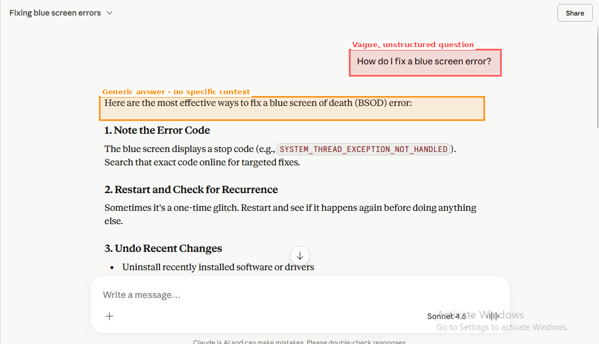
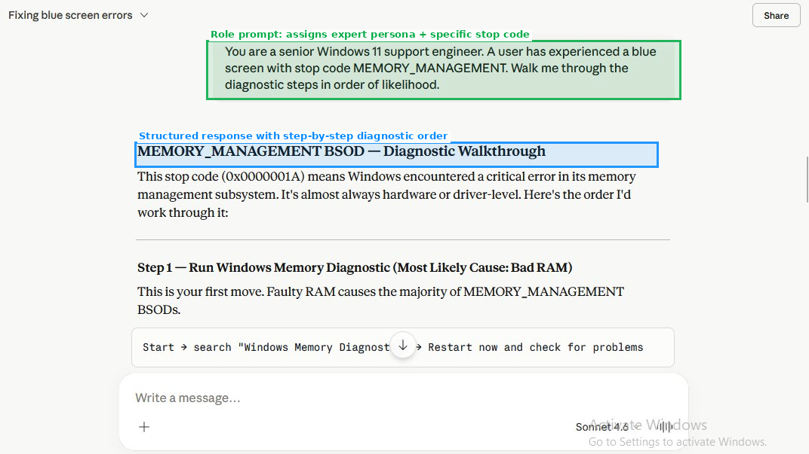
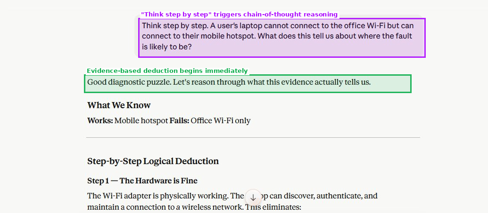
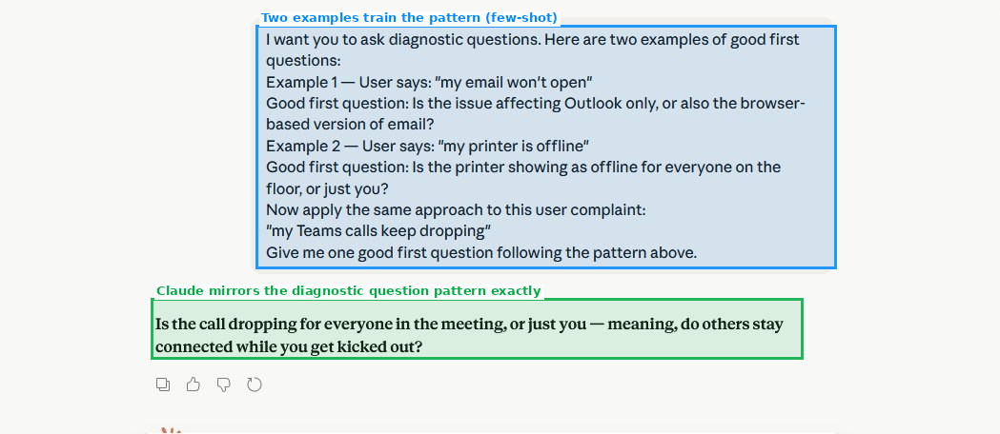
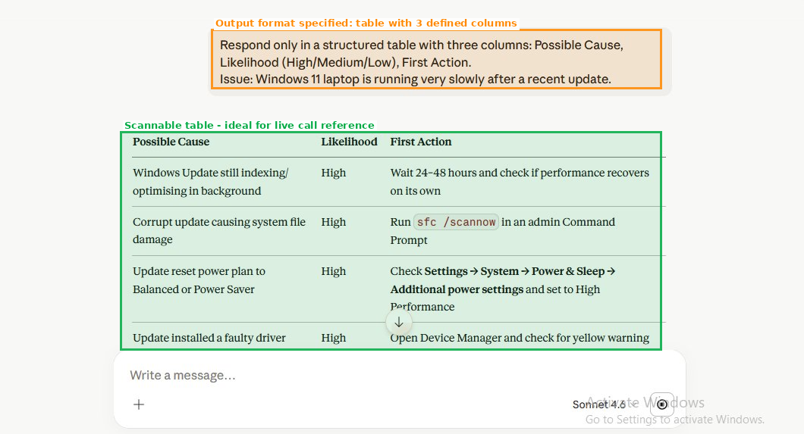
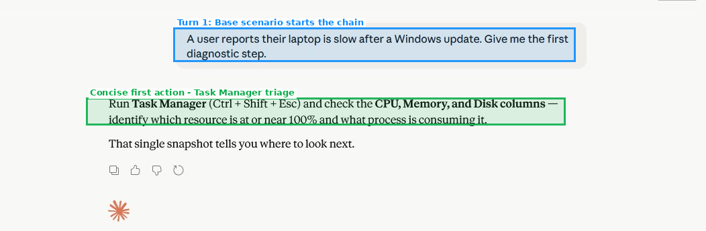
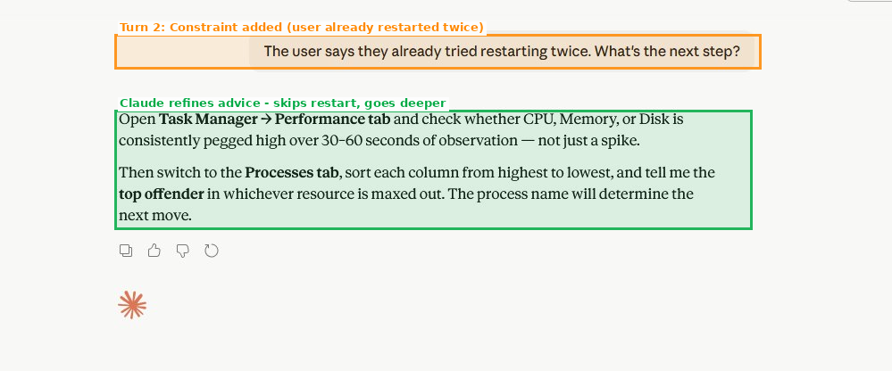
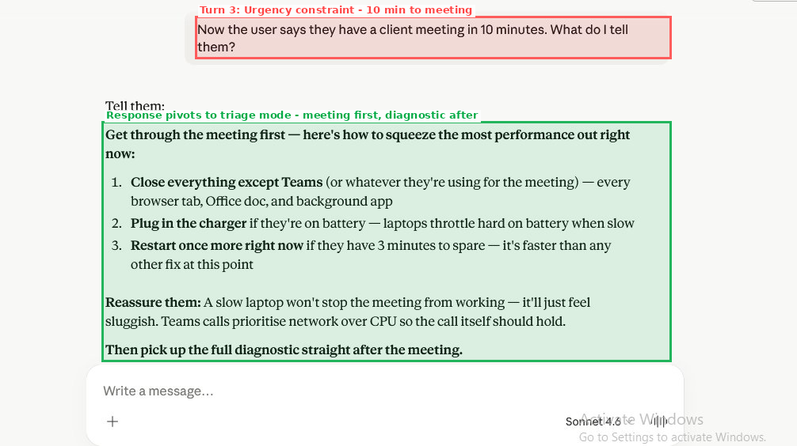
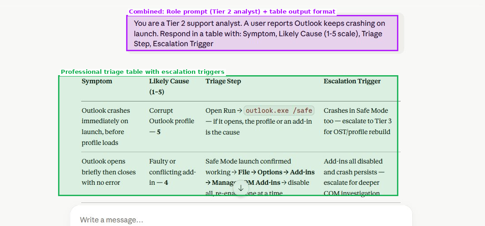

# Lab 3: Advanced Prompting Techniques for IT Support

**AI Foundations | Claude | Priority: High**

---

## Objective

Master four professional prompting techniques - role prompting, chain-of-thought, few-shot examples, and output formatting - and demonstrate how each one improves the quality and usefulness of AI responses in an IT support context.

---

## Business Scenario

Your team lead has noticed that different analysts are getting very different quality responses from Claude. Some get vague answers; others get structured, actionable guidance. She asks you to research and document the prompting techniques that produce the best results for IT support tasks, then train the rest of the team.

This README is written as a team training guide - the kind of document you would hand to a new colleague on their first week.

---

## Tools Used

| Tool | Purpose |
|------|---------|
| Claude.ai (free account) | AI platform for all prompt testing |
| Role Prompting | Assign expert persona to Claude |
| Chain-of-Thought | Trigger step-by-step logical reasoning |
| Few-Shot Prompting | Teach pattern via examples before the real question |
| Output Formatting | Control response structure (tables, columns) |
| GitHub | Documentation and team training guide |

---

## Steps Performed

1. Test a basic unstructured prompt and screenshot the response
2. Rewrite the same question as a role prompt and compare quality
3. Apply chain-of-thought prompting to a Wi-Fi diagnostic scenario
4. Apply few-shot prompting to a Teams call-dropping complaint
5. Apply output formatting to produce a scannable table
6. Test context chaining across a multi-turn troubleshooting conversation
7. Combine role prompting and output formatting in a single prompt
8. Evaluate which technique has the highest practical value for live service desk work
9. Produce a prompting cheat sheet for the team

---

## Before and After: The Blue Screen Evidence

This is the clearest demonstration of how prompting technique changes output quality.

### Before - Unstructured Prompt

**Prompt used:**
```
How do I fix a blue screen error?
```



**What you get:** A generic 10-step list covering every possible BSOD cause. Useful as a checklist, but not actionable during a live call. You still have to mentally filter it for the specific situation. No structure, no prioritisation, no next question to ask the user.

---

### After - Role Prompt

**Prompt used:**
```
You are a senior Windows 11 support engineer. A user has experienced a blue screen
with stop code MEMORY_MANAGEMENT. Walk me through the diagnostic steps in order of likelihood.
```



**What you get:** A prioritised diagnostic walkthrough ordered by likelihood, starting with the most common cause (faulty RAM). Includes specific commands, file paths, decision trees, and escalation logic. Ready to use on a live call with no additional mental work.

**The difference:** Same topic. Completely different usefulness. The role prompt gave Claude a persona, a specific stop code, and a structural instruction (order of likelihood). That context shaped everything.

---

## The Four Techniques - Demonstrated

### Technique 1: Role Prompting

Assign Claude an expert role before asking your question. This anchors the response in professional reasoning and appropriate depth.

**Template:**
```
You are a [role/level]. A user reports [specific issue with details].
[Your question or instruction].
```

**Screenshot:**


**Why it works:** Claude calibrates its vocabulary, depth, and assumptions to the role you specify. "Senior Windows 11 support engineer" produces a different response than "helpful assistant" for the same question.

---

### Technique 2: Chain-of-Thought

Instruct Claude to reason step by step before reaching a conclusion. This surfaces the logic behind the answer, not just the answer itself.

**Prompt used:**
```
Think step by step. A user's laptop cannot connect to the office Wi-Fi but can connect
to their mobile hotspot. What does this tell us about where the fault is likely to be?
```

**Screenshot:**



**What changes:** Claude works through the evidence systematically - the hotspot working rules out the Wi-Fi card, the OS network stack, and driver failures. The fault boundary narrows logically to the relationship between this laptop and this specific network. This is the kind of reasoning an experienced analyst does in their head; chain-of-thought makes it visible and shareable.

---

### Technique 3: Few-Shot Prompting

Provide two or three examples of the pattern you want, then ask your real question. Claude learns the format and applies it.

**Prompt used:**
```
I want you to ask diagnostic questions. Here are two examples of good first questions:
Example 1 - User says: "my email won't open"
Good first question: Is the issue affecting Outlook only, or also the browser-based version?
Example 2 - User says: "my printer is offline"
Good first question: Is the printer showing as offline for everyone on the floor, or just you?
Now apply the same approach to: "my Teams calls keep dropping"
```

**Screenshot:**



**Claude's response:**
> Is the call dropping for everyone in the meeting, or just you - meaning, do others stay connected while you get kicked out?

**Why this is good:** This question immediately isolates whether the problem is the user's device/network or the meeting infrastructure. That single answer routes the entire diagnostic differently. Few-shot taught Claude the pattern of "scope-narrowing first question" without you having to describe the pattern in abstract terms.

---

### Technique 4: Output Formatting

Specify the exact structure of the response. Tables, bullet lists, column headings, numbered steps - whatever is most useful for how you will actually use the answer.

**Prompt used:**
```
Respond only in a structured table with three columns: Possible Cause,
Likelihood (High/Medium/Low), First Action.
Issue: Windows 11 laptop is running very slowly after a recent update.
```

**Screenshot:**



**Why the table format matters during a live call:** A paragraph answer requires you to read, parse, and mentally reformat while the user is waiting. A table lets you scan the Likelihood column first, jump to High, and read the First Action. You can share your screen and walk the user through it. You can paste it into your ticket notes. Format is not cosmetic - it is functional.

---

## Context Chaining: A Multi-Turn Troubleshooting Simulation

This demonstrates how to chain prompts across a conversation, adding constraints progressively as a real call unfolds.

**Turn 1 - Base scenario:**



Prompt: *"A user reports their laptop is slow after a Windows update. Give me the first diagnostic step."*

Response: Open Task Manager, check CPU, Memory, Disk usage, identify the top offender.

---

**Turn 2 - Add a constraint:**



Prompt: *"The user says they already tried restarting twice. What's the next step?"*

Response: Claude skips the restart suggestion and moves to the Performance tab and Processes tab - deeper triage. It remembered the constraint.

---

**Turn 3 - Add urgency:**



Prompt: *"Now the user says they have a client meeting in 10 minutes. What do I tell them?"*

Response: Claude pivots entirely. It stops the diagnostic, gives three immediate actions (close everything, plug in charger, one final restart), reassures the user, and defers the full diagnostic to after the meeting. The response matched the real-world priority shift perfectly.

**The lesson:** Claude retains context within a conversation. You do not need to re-explain the situation on every turn. Add information as you receive it and the advice evolves with the call.

---

## Combined Technique: Role Prompting + Output Formatting

**Prompt used:**
```
You are a Tier 2 support analyst. A user reports Outlook keeps crashing on launch.
Respond in a table with: Symptom, Likely Cause (1-5 scale), Triage Step, Escalation Trigger
```

**Screenshot:**



**Result:** A professional triage table with likelihood scoring (1-5), specific triage steps including exact commands (`outlook.exe /safe`), and explicit escalation triggers that tell you exactly when to hand off to Tier 3. This is the kind of output you would paste directly into a runbook or use as a live reference during an escalation call.

---

## Outcome

- Four prompting techniques demonstrated with before and after evidence
- Context chaining demonstrated across a three-turn troubleshooting simulation
- Combined technique (role + formatting) demonstrated with a Tier 2 escalation scenario
- Prompting cheat sheet published in `prompting-cheat-sheet.md`
- Full prompt and response log in `prompts-log.md`

---

## What I Learned

The most important insight from this lab is that the quality of an AI response is almost entirely determined by the quality of the prompt - not the AI's capability. Claude gave a generic 10-step BSOD list when asked generically, and a prioritised, expert-level diagnostic walkthrough for the exact same problem when given a role and a specific stop code. The information gap between those two responses is not Claude's knowledge - it is the analyst's prompting skill.

For live service desk work, **role prompting combined with output formatting** is the highest-value combination. Role prompting raises the depth and precision of the reasoning; output formatting makes the response immediately usable without additional processing. Together, they close the gap between "AI gave me an answer" and "I can use this right now on this call."

Chain-of-thought is the technique with the highest learning value. Seeing Claude reason through a diagnostic step by step teaches you how experienced engineers think about fault isolation - which makes you better at diagnostics even when you are not using AI.

---

## Why Prompting Skill Matters for IT Career Progression

AI literacy is increasingly listed in service desk and analyst job descriptions. The expectation is no longer just "can you use the tools" but "can you use AI to work faster and to a higher standard than someone who does not."

Prompting skill is specifically mentioned because it is the difference between an AI that helps and an AI that produces noise. Analysts who can write a role prompt, chain context across a call, and format output for live use are operationally faster than those who paste generic questions and manually parse long answers.

As AI becomes embedded in ITSM tools, ticketing platforms, and remote support stacks, the analysts who understand how to direct AI effectively will move into senior analyst, team lead, and AI implementation roles faster than those who treat it as a search engine. This lab is foundational to that progression.

Prompting skill is also transferable. The techniques in this lab apply to any AI platform - not just Claude. Learning them now builds a skill that compounds as the tools evolve.

---

## Files in This Repository

| File | Description |
|------|-------------|
| `README.md` | This file - team training guide and lab documentation |
| `prompting-cheat-sheet.md` | Quick reference for all four techniques with templates and IT examples |
| `prompts-log.md` | Full record of every prompt and response used in this lab |
| `screenshots/` | Annotated screenshots from Claude.ai for each technique |

---

*Lab 3 - AI Foundations | Claude.ai | Documented for team training purposes*
