# Use AI to Analyse Windows Event Logs and System Errors

> **Author:** Nnamso Mkpong
>
> **Domain:** AI-Assisted Scripting - Claude + Windows Event Viewer + PowerShell
>
> **Environment:** Windows 11, Event Viewer, Claude.ai (Sonnet 4.6), WPS Office
>
> **Completed:** May 2026

---

## Objective

Export real Windows Event Log entries from System and Application logs, upload them to Claude for analysis, and demonstrate that AI can identify patterns, surface root causes, and recommend remediation steps faster than manual log review - while clearly documenting the limits of AI interpretation.

---

## Business Scenario

> **Intermittent Laptop Crashes - AI Triage Request - May 2026**
>
> A user's laptop has been crashing intermittently for three days. Every time the technician remotes in after a crash, the issue seems resolved until it happens again. The team lead asks for a structured analysis of Windows Event Logs from the crash period. Manual review of 42,238 total System log entries and 18,053 Application log entries is too slow for a service desk shift - AI-assisted triage is required.

The goal is not to use AI instead of Event Viewer. The goal is to use Event Viewer to collect the right data, sanitise it, and give AI the specific log sample it needs to surface patterns and root causes in seconds rather than hours. The output is a documented root cause hypothesis, a remediation plan, and a PowerShell script for future log collection - all validated by the analyst.

---

## Environment and Tools Used

| Component | Detail |
|---|---|
| **Platform** | Claude.ai - Sonnet 4.6, Free plan |
| **Conversation title** | Diagnosing Windows crash errors from event logs |
| **Log sources** | Windows Event Viewer - System and Application logs |
| **Total System log entries** | 42,238 total - 118 filtered (Critical + Error, last 7 days) |
| **Total Application log entries** | 18,053 total - 251 filtered (Critical + Error, last 7 days) |
| **System log finding** | Event ID 7034 - Camera Frame Server crash loop (94 crashes) |
| **Application log finding** | Event ID 100 - Bonjour Service hostname conflict |
| **Export format** | CSV via Event Viewer Save Selected Events |
| **PowerShell script** | Get-WinEvent one-liner for automated log extraction |
| **Hostname** | Shark007 (machine name, not PII - retained in sanitised export) |

---

## What AI Log Analysis Can and Cannot Do

> **AI is a pattern recognition and plain-language translation engine. It is not a replacement for physical inspection, network-side verification, or analyst judgement on ambiguous events.**

### What AI Does Well

**Pattern recognition across large log sets.** AI identified that all 23 exported System log entries were the same event type (Event ID 7034) and noted the counter escalation from 72 to 94 - evidence the loop was running before the export window. Manual review would require sorting and grouping first.

**Plain-language explanation of technical events.** "The Windows Camera Frame Server service is crashing and immediately restarting - 94 times in roughly 3 minutes" is more immediately actionable for a Tier 1 analyst than reading raw event log XML. AI translates event log language into operational language.

**Cross-log pattern correlation.** When given both System and Application logs, AI correctly identified that Event ID 7034 (camera service crash loop) and Event ID 100 (Bonjour hostname conflict) shared a common trigger - network reconnection or wake from sleep - rather than claiming one caused the other. This coincident-not-causal reasoning is accurate and nuanced.

**Remediation step generation with exact commands.** AI produced a four-phase remediation plan with exact command-line syntax (net stop FrameServer, sc config, sfc /scannow, DISM) and exact navigation paths (Device Manager - Cameras - Driver tab). These steps are copy-pasteable into a support call workflow.

**PowerShell script generation.** AI produced a correct, parameterised Get-WinEvent one-liner with correct level codes (Level=1 for Critical, Level=2 for Error), dynamic time window, and appropriate output formatting. CSV export and multi-log variants were also provided.

### Where Human Judgment is Still Essential

**Confirming physical hardware issues.** AI identified the crash loop and recommended checking C:\Windows\Minidump\ for BSOD evidence. Only the analyst (or Tier 2) can physically access the machine to inspect the minidump, camera hardware, and motherboard connection. AI cannot do this.

**Verifying network-side events.** AI hypothesised that the shared trigger for both events was a network reconnection or wake event. Confirming this requires pulling Wi-Fi connection events, Kernel-Power events (Event ID 1), and uptime markers (Event ID 6013) from the same timestamp range - and correlating them with the user's account of when crashes occurred. AI suggests this investigation; the analyst executes it.

**Assessing log completeness.** AI flagged that the System log export contained only one event type, which is unusual for a genuinely crashing machine, and recommended a broader export. AI cannot tell whether the absence of disk/memory errors means they did not occur, or whether the export was filtered too narrowly. The analyst determines this.

**Security-adjacent events.** The Application log contained Security-SPP Event ID 8198 (software licensing). AI surfaces this but cannot determine whether it represents a compliance issue, a routine check, or tampered software. Security classification requires human judgement and organisational context.

**Escalation timing decisions.** AI recommends escalating if minidump files are present or driver steps fail. But the decision about when to escalate depends on the user's role, business impact urgency, and team SLA - factors the analyst knows and AI does not.

---

## Steps Performed

---

### Phase 1 - Open Windows Event Viewer

**Step 1.1 - Launch Event Viewer Using the Run Dialog**

Press Win + R to open the Run dialog. Type eventvwr.msc and press OK.

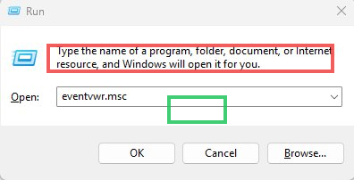

> **Red highlight:** The Run dialog input field containing eventvwr.msc. This is the fastest way to open Event Viewer, including from a remote desktop session.
>
> **Green highlight:** The OK button. Event Viewer opens directly to the Windows Logs overview with summary counts for each log category.

---

### Phase 2 - Filter the System Log

**Step 2.1 - Apply Filter: Critical and Error, Last 7 Days, System Log**

Navigate to Windows Logs - System. In the Actions panel, click Filter Current Log.

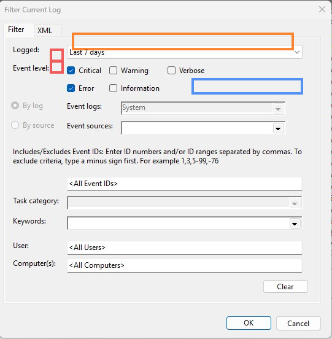

> **Red highlight (checkboxes):** Critical and Error checked. This filters out Informational, Warning, and Verbose events. The 42,238 total System log entries reduce to 118 when filtered to Critical and Error only.
>
> **Orange highlight:** Logged dropdown set to "Last 7 days". For a crash investigation, 7 days captures enough history to see patterns without excessive data.
>
> **Blue highlight:** Event logs field showing "System" - confirming this filter applies to the System log only.

---

### Phase 3 - Review System Log Results

**Step 3.1 - Examine the Filtered Event List and Identify the Dominant Error**

After applying the filter, 118 results appear. All visible rows are the same event.

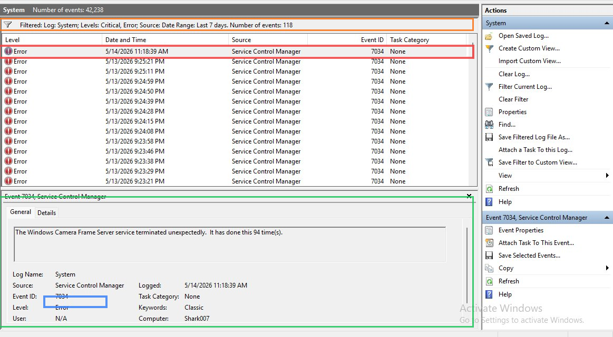

> **Orange highlight:** Filter summary bar - "Filtered: Log: System; Levels: Critical, Error; Source: Date Range: Last 7 days. Number of events: 118."
>
> **Red highlight:** Top event row - 5/14/2026 11:18:39 AM, Service Control Manager, Event ID 7034. All visible rows show the same event, indicating a single service failing repeatedly.
>
> **Green highlight:** Event detail panel showing: "The Windows Camera Frame Server service terminated unexpectedly. It has done this 94 time(s)." - the key diagnostic finding. A crash count of 94 indicates a crash loop, not a one-time failure.
>
> **Blue highlight:** The Computer field showing "Shark007" - the machine hostname. In a sanitised export this would be replaced with WORKSTATION01.

---

### Phase 4 - Select and Save System Log Events

**Step 4.1 - Select Events and Use Save Selected Events**

Select all visible events (Ctrl+A), then right-click for the context menu.

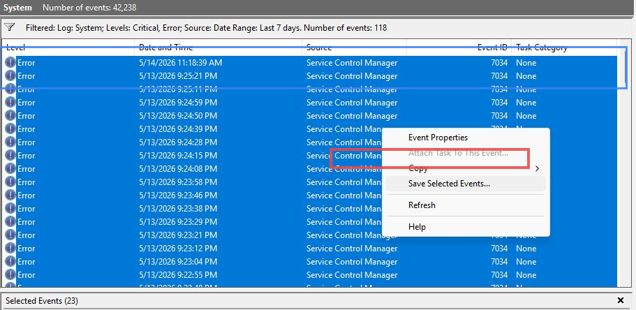

> **Red highlight:** "Save Selected Events..." in the context menu. This exports only the selected events, not the entire log.
>
> **Orange highlight:** "Selected Events (23)" count bar at the bottom, confirming 23 events are selected.
>
> **Blue highlight:** The highlighted event rows spanning 5/13/2026 to 5/14/2026 - all Event ID 7034.

---

### Phase 5 - Save as CSV

**Step 5.1 - Save the Selected Events in CSV Format**

Name the file "Sample Log file.csv" and set format to CSV (Comma Separated).

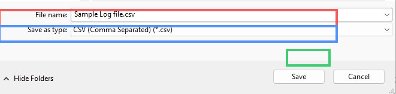

> **Red highlight:** The file name field - "Sample Log file.csv". A descriptive name avoids confusion when attaching to Claude.
>
> **Blue highlight:** Save as type field - "CSV (Comma Separated) (*.csv)". CSV is the preferred format for AI analysis - plain text readable directly from an attachment, and reviewable in any spreadsheet application before upload.
>
> **Green highlight:** The Save button.

---

### Phase 6 - Review and Sanitise the System Log CSV

**Step 6.1 - Open the CSV and Verify Contents Before Upload**

Open the saved CSV in WPS Office. Review each column for personally identifiable information.

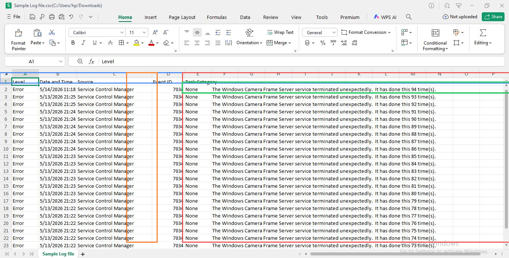

> **Blue highlight:** Header row - Level, Date and Time, Source, Event ID, Task Category, followed by message columns.
>
> **Orange highlight:** The Event ID column showing 7034 in every row - visual confirmation the export captured only the relevant events.
>
> **Red highlight:** Message columns showing "The Windows Camera Frame Server service terminated unexpectedly. It has done this 94 time(s)." with the counter decrementing (94, 93, 92...) in older rows. The decrement pattern confirms the log captured the end of the crash loop.
>
> **Green highlight:** First data row (row 2) with the 94-count entry - the most recent crash.
>
> Sanitisation check: No usernames found. Computer field (Shark007) is a machine hostname, not a personal name - retained. No email addresses or employee IDs in message text. Safe to upload.

---

### Phase 7 - Upload System Log to Claude and Request Analysis

**Step 7.1 - Attach the CSV and Send the Analysis Prompt**

Attach the sanitised CSV to a new Claude conversation with the structured analysis prompt.

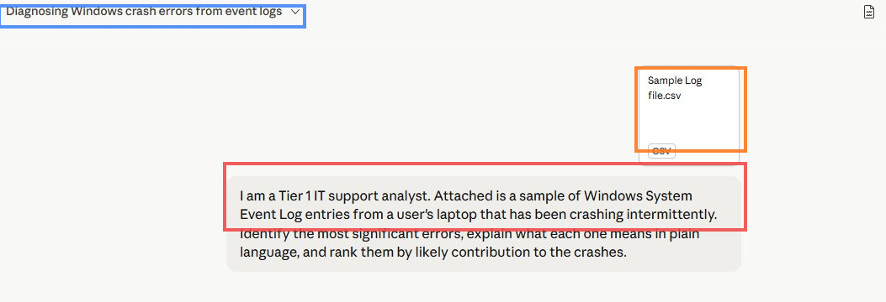

> **Orange highlight:** The CSV file attachment - "Sample Log file.csv" shown as a CSV card. Claude reads the full contents including all rows and columns.
>
> **Red highlight:** The prompt: "I am a Tier 1 IT support analyst. Attached is a sample of Windows System Event Log entries from a user's laptop that has been crashing intermittently. Identify the most significant errors, explain what each one means in plain language, and rank them by likely contribution to the crashes."
>
> **Blue highlight:** The conversation title "Diagnosing Windows crash errors from event logs" - auto-generated from context. All subsequent prompts run within this conversation.
>
> Claude's analysis: 23 entries, 1 unique event type, crash count 94. Identified Event ID 7034 as Camera Frame Server crash loop. Flagged the absence of other event types as a caution about export completeness. Recommended five next steps. Full analysis in log-analysis-findings.md.

---

### Phase 8 - Filter the Application Log

**Step 8.1 - Apply the Same Filter to Windows Logs - Application**

Navigate to Windows Logs - Application and apply Critical + Error filter for the last 7 days.

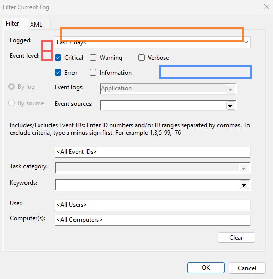

> **Red highlight (checkboxes):** Critical and Error checked - same filter levels as the System log.
>
> **Orange highlight:** Last 7 days - same date range.
>
> **Blue highlight:** Event logs field now showing "Application" instead of "System". The Application log captures user-mode application and service events; the System log captures kernel and system service events.
>
> Application log filtered result: 251 events (vs 118 in System log). The Application log total is 18,053 entries.

---

### Phase 9 - Save Selected Application Log Events

**Step 9.1 - Select Bonjour Service Events and Save**

Bonjour Service Event ID 100 is the dominant Application log error. Select relevant entries and save.

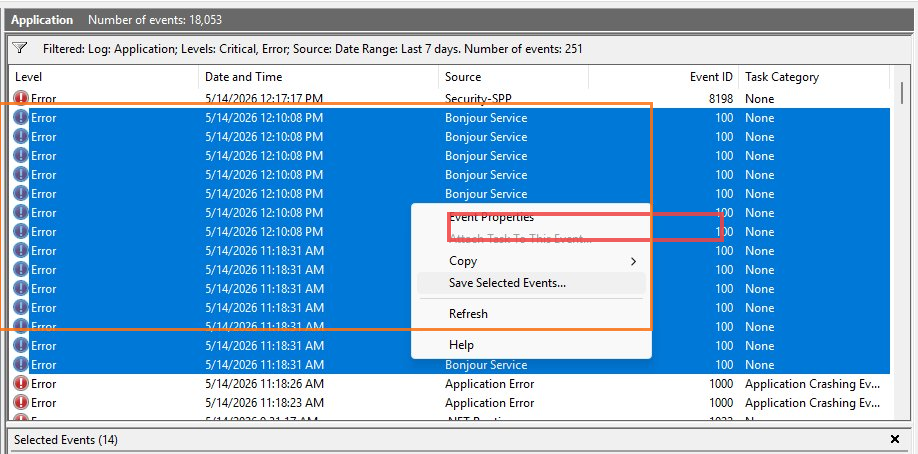

> **Red highlight:** "Save Selected Events..." context menu option - same method as the System log export.
>
> **Orange highlight:** Bonjour Service rows (Event ID 100) in the list, appearing in bursts at 11:18 AM and 12:10 PM on 5/14/2026. The Security-SPP entry (Event ID 8198) is also visible at the top.
>
> **Blue highlight:** "Selected Events (14)" count bar. 14 events selected - the Bonjour Service burst entries plus surrounding context.
>
> The two burst times (11:18 AM and 12:10 PM) are 52 minutes apart. These timestamps are the key data points for the cross-log pattern analysis.

---

### Phase 10 - Save Application Log as CSV

**Step 10.1 - Save the Application Log Events as CSV**

Save selected Application log events as CSV.

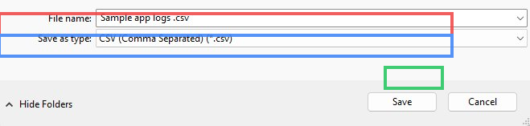

> **Red highlight:** File name "Sample app logs .csv" - distinct from the System log CSV to prevent confusion.
>
> **Blue highlight:** CSV (Comma Separated) format - consistent with System log export.
>
> **Green highlight:** Save button.
>
> Two separate CSV files now exist: Sample Log file.csv (System, Event ID 7034, 23 entries) and Sample app logs .csv (Application, Event ID 100, 14 entries).

---

### Phase 11 - Review and Sanitise the Application Log CSV

**Step 11.1 - Open the Application Log CSV and Check for Sensitive Data**

Open the Application log CSV in WPS Office. Review for PII before uploading.

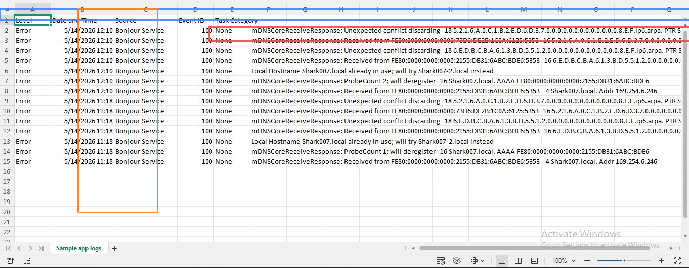

> **Blue highlight:** Header row - Level, Date and Time, Source, Event ID, Task Category, message column.
>
> **Orange highlight:** Source column showing "Bonjour Service" in every row - export is clean with only Bonjour entries.
>
> **Red highlight:** Row 6 showing the key diagnostic message - "Local Hostname Shark007.local already in use; will try Shark007-2.local instead." This is the mDNS hostname conflict that identifies another device on the network claiming the same name.
>
> Sanitisation check: "Shark007.local" is a machine-assigned mDNS name, not a personal name. IPv6 addresses (FE80:...) are link-local and do not expose user identity. No usernames, employee IDs, or personal data found. Safe to upload.

---

### Phase 12 - Upload Application Log to Claude for Cross-Log Analysis

**Step 12.1 - Attach Application Log CSV and Request Pattern Comparison**

Attach the Application log CSV to the existing conversation and send the cross-log prompt.

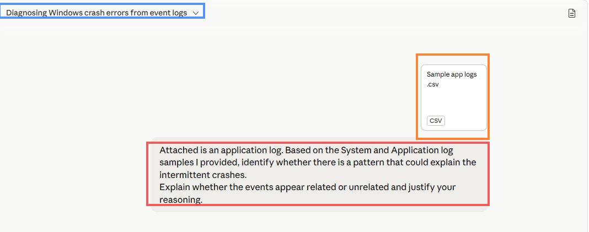

> **Orange highlight:** "Sample app logs .csv" attachment. Claude retains System log context from the previous prompt and uses both files together.
>
> **Red highlight:** The cross-log prompt: "Attached is an application log. Based on the System and Application log samples I provided, identify whether there is a pattern that could explain the intermittent crashes. Explain whether the events appear related or unrelated and justify your reasoning."
>
> **Blue highlight:** Conversation title - same "Diagnosing Windows crash errors from event logs" session.
>
> Claude's conclusion: coincident but not causally linked. Both events likely triggered by the same upstream event (network reconnection or wake from sleep). Event ID 7034 is the direct crash contributor. Event ID 100 is harmless noise from the same trigger. Upstream root cause hypothesis: network adapter driver or Windows power management. Full analysis in log-analysis-findings.md.

---

### Phase 13 - Generate the PowerShell Log Extraction One-Liner

**Step 13.1 - Request PowerShell Command for Automated Log Collection**

Send the final prompt requesting a PowerShell command for future log collection.

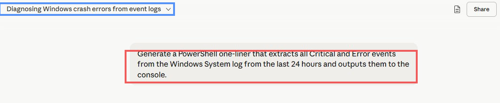

> **Red highlight:** The PowerShell prompt: "Generate a PowerShell one-liner that extracts all Critical and Error events from the Windows System log from the last 24 hours and outputs them to the console."
>
> **Blue highlight:** Same conversation session - Claude still has all log analysis context.
>
> Claude produced the correct Get-WinEvent command with FilterHashtable (faster than Where-Object on large logs), Level codes 1 and 2, dynamic 24-hour window, and Format-List output. CSV export and multi-log variants also provided. Full script in extract-system-errors.ps1.

---

## Log Analysis Findings Summary

### System Log

| Field | Value |
|---|---|
| **Event ID** | 7034 |
| **Source** | Service Control Manager |
| **Service** | Windows Camera Frame Server (FrameServer) |
| **Crash count** | 94 recorded (started at 72 before export window) |
| **Pattern** | Crash loop - every 8-10 seconds at peak |
| **AI accuracy** | High - crash loop, counter escalation, resource exhaustion risk all correct |
| **Root cause hypothesis** | Bad camera driver update (Windows Update or Teams/Zoom) |

### Application Log

| Field | Value |
|---|---|
| **Event ID** | 100 |
| **Source** | Bonjour Service |
| **Issue** | mDNS hostname conflict (Shark007.local already claimed) |
| **Burst times** | 11:18 AM and 12:10 PM on 5/14/2026 (52 min apart) |
| **Crash contribution** | None - harmless self-resolving network event |
| **AI accuracy** | Very High - correctly assessed as coincident but harmless |

### Cross-Log Correlation

Both events share a common trigger: network reconnection or wake from sleep. The camera driver loses hardware context on reconnection and enters a crash loop. Bonjour re-probes for hostname conflicts on the same network event. Upstream root cause: network adapter driver or Windows power management - Tier 2 escalation with this specific hypothesis is the recommended path.

---

## Help Desk Ticket Notes

See `TICKET_NOTES.md` for Event ID quick reference, sanitisation checklist, Event Viewer navigation paths, all PowerShell commands, and the AI triage decision guide.

---

## Outcome and Validation

| Check | Result |
|---|---|
| Event Viewer opened via eventvwr.msc | Pass |
| System log filtered: Critical + Error, last 7 days - 118 events | Pass |
| System log 23 events exported and saved as CSV | Pass |
| CSV reviewed and sanitised - no PII found | Pass |
| System log uploaded to Claude with structured analysis prompt | Pass |
| Claude correctly identified Event ID 7034 crash loop | Pass |
| Remediation steps requested and received (four phases) | Pass |
| Application log filtered: Critical + Error, last 7 days - 251 events | Pass |
| Application log 14 events exported and saved as CSV | Pass |
| Application log CSV sanitised - no PII found | Pass |
| Cross-log pattern analysis prompt sent and evaluated | Pass |
| Coincident-not-causal reasoning correctly produced by Claude | Pass |
| PowerShell one-liner requested, received, and documented | Pass |
| What AI Can and Cannot Do section written | Pass |
| log-analysis-findings.md created | Pass |
| prompts-log.md created | Pass |
| extract-system-errors.ps1 created | Pass |
| sample-event-log.txt created | Pass |

---

## What I Learned

1. **Filter before export - this determines the quality of AI output.** The System log had 42,238 entries. Filtering to Critical + Error + Last 7 days reduced that to 118. Selecting the 23 most relevant entries gave Claude a focused, clean data set that produced a precise analysis. An unfiltered dump would produce a less useful response and risk context window limits.

2. **AI pattern recognition on log data is faster than manual review.** Claude identified that all 23 System log entries were the same event type, noted the counter escalation from 72 to 94, and estimated the crash frequency in under five seconds. A trained analyst would need 5-10 minutes of sorting and scanning to reach the same conclusion.

3. **Cross-log correlation is where AI provides the most diagnostic value.** Neither the System log nor the Application log alone tells the full story. Giving Claude both logs and asking for correlation produced the upstream root cause hypothesis (network reconnection) that single-log analysis would have missed.

4. **AI correctly flags its own limitations when log data is incomplete.** Claude noted the unusual absence of disk errors, memory faults, and WHEA events - and explicitly recommended a broader export. This self-flagging is more reliable than assuming absence of evidence equals evidence of absence.

5. **PowerShell log extraction reduces future investigation time.** The Get-WinEvent one-liner is reusable and can be run from a remote PowerShell session without opening Event Viewer. Documenting it as a script file means any analyst on the team can use it.

---

## Real World Relevance

In a service desk environment handling 80+ calls per day, the bottleneck in crash investigation is not finding the right tool - it is the time between opening Event Viewer and having a prioritised list of what to investigate. An analyst manually reviewing 118 filtered log entries spends 20-30 minutes on research that AI can produce in under two minutes when given the right data.

The workflow in this lab - filter, export, sanitise, upload, analyse, validate - is the correct model for AI-assisted log analysis. The filter-before-export step makes AI output actionable. The sanitise-before-upload step makes the workflow safe for corporate environments. The validate step distinguishes a professional analyst from someone who blindly follows AI output.

The upstream root cause hypothesis from this lab (network adapter driver or power management mishandling reconnection) is the kind of finding that would normally require a Tier 2 engineer to manually correlate System and Application log timestamps. AI produced it at Tier 1 - that is the real-world value proposition.

---

## Troubleshooting Reference

| Situation | Correct Action | Common Mistake |
|---|---|---|
| Filtered Event Viewer view shows no events | Check date range and verify both Critical and Error are checked. Also check the machine clock is correct. | Assuming the machine has no errors because the filtered view is empty |
| CSV contains real usernames in the User field | Open in text editor, replace all instances with USER01. Check Computer field too. | Uploading a CSV with real usernames to a cloud AI tool |
| Claude returns a generic response not referencing specific events | Verify the CSV was attached correctly as a file. Check the file has a proper header row. Paste first 5 rows directly as backup. | Assuming the generic response is the best available output |
| Get-WinEvent returns "Access is denied" | Run PowerShell as Administrator - System log queries require elevated privileges. | Running the command in a standard user session and concluding the command is wrong |
| No minidump files at C:\Windows\Minidump\ | Machine has not experienced a full BSOD. Check if Small memory dump is configured: System Properties - Advanced - Startup and Recovery. | Concluding the machine has never crashed because no minidump exists |
