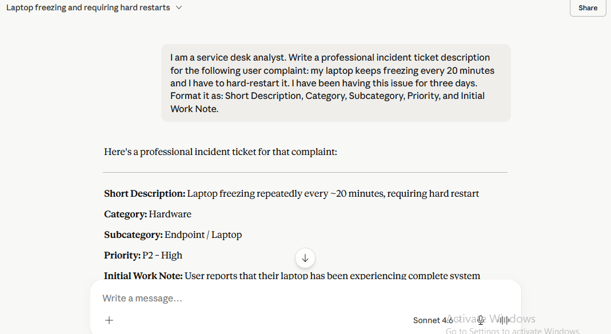
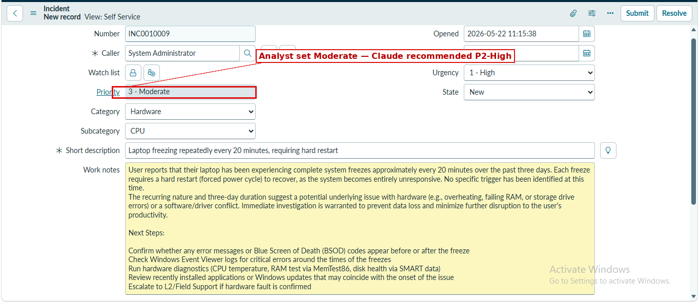
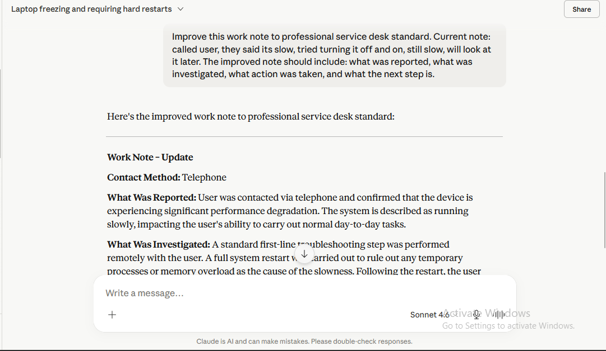
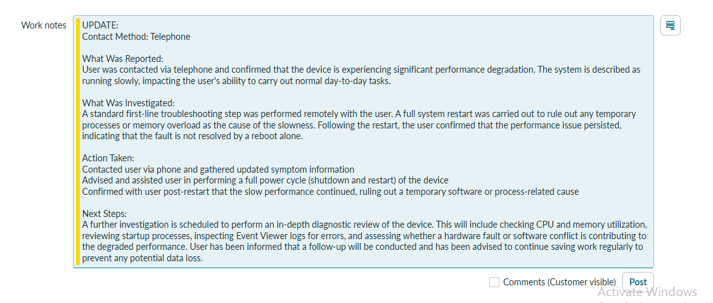
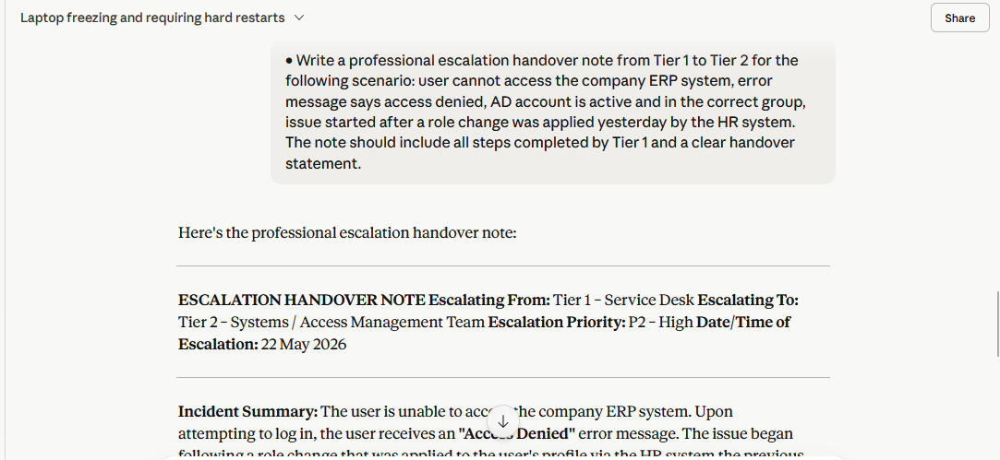
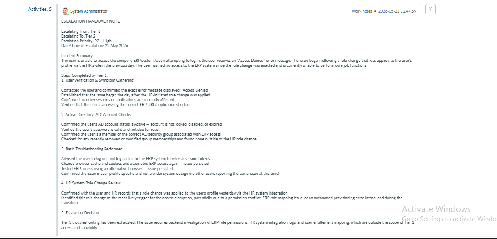
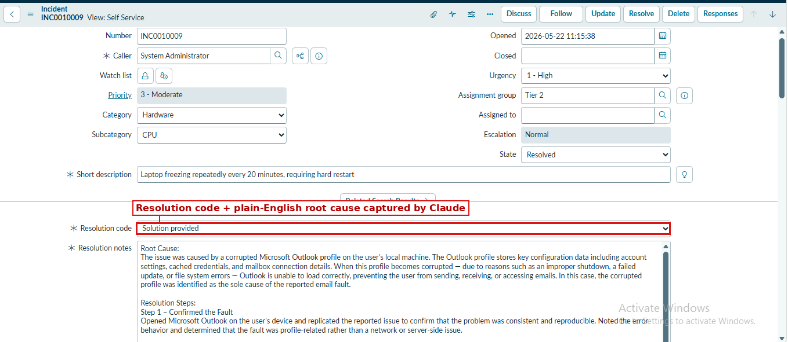
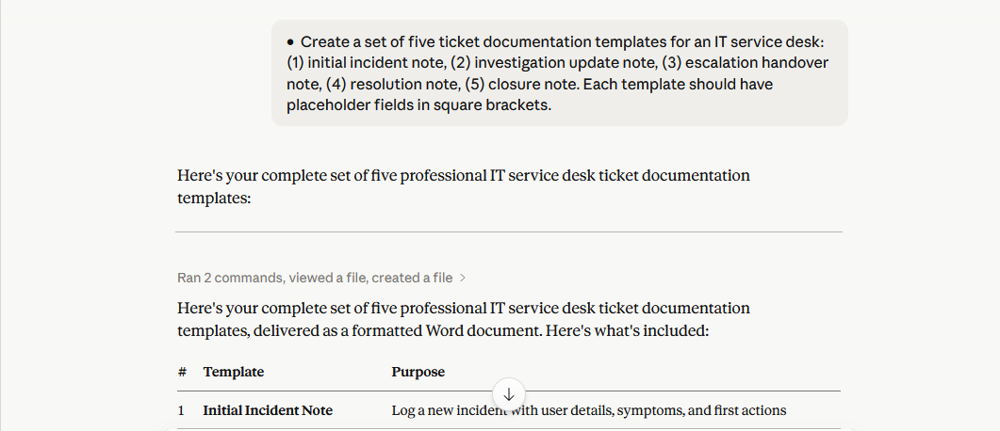

# Lab 7: AI-Assisted Ticket and Handover Documentation

> **Author:** Nnamso Mkpong
>
> **Domain:** AI Foundations - Claude.ai and ChatGPT for IT Support
>
> **Environment:** claude.ai (Free plan) and chat.openai.com (Free plan) - Chrome browser
>
> **Completed:** July 2026

**AI for Documentation | Claude | Priority: Critical**

## Objective

Use Claude to draft, improve, and standardise ticket descriptions, work notes, and escalation handover notes - demonstrating that AI-assisted documentation produces more consistent, professional records than unassisted writing and reduces the risk of information loss during shift handover.

## Business Scenario

The service desk team leader reviews tickets every week and regularly finds work notes that are too vague, escalation notes that are missing critical information, and tickets that are closed without a proper resolution summary. This lab uses AI to build a template library and demonstrates how Claude can lift a set of poorly written tickets to a professional standard.

## Tools Used

| Tool | Purpose |
|---|---|
| Claude.ai | Drafting, improving, and standardising ticket documentation |
| ServiceNow | Logging tickets and applying AI-generated content to live incident records |
| Markdown / GitHub | Publishing the reusable template library and lab evidence |

## Steps Performed

### 1. Generate a professional incident ticket from a raw complaint

Claude was asked to convert a plain user complaint ("my laptop keeps freezing every 20 minutes") into a fully structured incident ticket with Short Description, Category, Subcategory, Priority, and an Initial Work Note.

The generated content was then logged directly into ServiceNow. Note the highlighted field below: Claude recommended **P2 - High**, but the ticket was logged as **Priority 3 - Moderate**. This is flagged deliberately as a reminder that AI-generated priority suggestions should always be checked against the organisation's actual priority matrix before being applied.

### 2. Improve a poor-quality work note to professional standard

A vague, real-world-style note ("called user, they said its slow, tried turning it off and on, still slow, will look at it later") was sent to Claude for improvement, with a requirement to include what was reported, what was investigated, what action was taken, and the next step.

The improved note was posted into the ServiceNow work notes field:

The full side-by-side comparison is documented in [`before-and-after.md`](before-and-after.md).

### 3. Generate an escalation handover note (Tier 1 to Tier 2)

Claude was given an ERP access scenario and asked to produce a full Tier 1-to-Tier 2 handover note, including every troubleshooting step already completed and a clear handover statement.

The note was added as a work note on the incident, giving Tier 2 a complete picture without needing to re-contact the user:

### 4. Draft a resolution note

Claude produced a resolution note for a corrupted Outlook profile scenario, including a resolution code, a plain-English root cause, and step-by-step resolution actions.

### 5. Build a five-template documentation library

Claude was asked to generate five reusable templates covering the full lifecycle of a ticket: initial incident note, investigation update note, escalation handover note, resolution note, and closure note, each with placeholder fields in square brackets.

The five templates were converted into individual markdown files and published in [`documentation-templates/`](documentation-templates/). The original Word document Claude generated is also included in this repository as `IT_ServiceDesk_Ticket_Templates.docx` for reference.

### 6. Validate the templates against real scenarios

Each of the five templates was tested by filling it in against the scenarios generated in Steps 1-4 (the laptop freezing incident, the escalation handover, and the resolution). In every case, the template's structure matched what a senior analyst would expect to see in a well-run service desk: clear ticket metadata, a plain-English summary, a bulleted action trail, and an explicit next step or closing statement. No gaps were found that required additional fields.

## Full Prompt and Response Log

Every prompt sent to Claude during this lab, along with the full response, is recorded in [`prompts-log.md`](prompts-log.md).

## Why Documentation Quality Affects Your Career

Poor ticket notes are one of the most common weaknesses flagged in service desk performance reviews. A vague note ("checked it, seems fine now") looks like low effort even when the underlying troubleshooting was thorough, because there is no written evidence of what was actually done. Managers, auditors, and QA reviewers can only judge the quality of your work by what you wrote down - not by what happened in your head during the call.

Weak documentation also has a direct cost during escalation and handover. If a Tier 1 note does not clearly state what was checked, what the result was, and why the issue is being escalated, the receiving analyst has to redo work that has already been completed, which slows down resolution and frustrates the user. Consistently strong documentation, on the other hand, is one of the fastest ways to stand out at review time and during job interviews, because it is concrete, checkable evidence of professionalism, attention to detail, and communication skill - all things that are hard to demonstrate any other way on a CV.

## How AI Improves Documentation Consistency at Scale

Individual analysts naturally write notes differently: some are terse, some ramble, some skip steps they consider "obvious." At the scale of a whole service desk team, this creates wide variation in ticket quality, making it hard for team leads to audit work or for new analysts to know what "good" looks like.

Using Claude as a standardisation layer solves this in three ways:

1. **Consistent structure every time.** Every note Claude produces follows the same shape - what was reported, what was investigated, what was done, what happens next - regardless of who is typing the initial rough note. This makes tickets easier to audit and easier to hand over.
2. **No loss of detail under time pressure.** Analysts under call volume pressure naturally write shorter notes. Claude can expand a two-line note into a complete record in seconds, without the analyst needing to spend extra time typing it out manually.
3. **A shared template library removes ambiguity.** Instead of every analyst inventing their own note format, the five templates in this repository give the whole team the same starting structure, so quality depends on the facts recorded, not on individual writing style.

The result is a documentation standard that scales across a team of any size, without requiring additional training time from the team lead.

## How to Validate This Lab

- [x] Five documentation templates published in [`documentation-templates/`](documentation-templates/)
- [x] Before-and-after comparison of a poor work note documented in [`before-and-after.md`](before-and-after.md)
- [x] Escalation handover note demonstrated (Step 3, screenshot 06)
- [x] Resolution note demonstrated (Step 4, screenshot 07)
- [x] This README contains the documentation quality career note and the AI-at-scale section above

## What I Learned

1. AI-generated documentation is only as trustworthy as the human review behind it - the priority discrepancy in Step 1 is proof that AI output should be checked, not copy-pasted blindly.
2. A short, vague note and a fully professional note can contain the exact same underlying facts; the difference is entirely in structure and completeness.
3. Escalation handovers are where poor documentation causes the most real-world damage, because a missing detail forces the next tier to repeat work.
4. A reusable template library is more valuable than one good ticket, because it fixes the team's documentation standard permanently rather than one ticket at a time.
5. Plain-English root cause explanations (as required in the resolution template) make tickets useful to non-technical stakeholders, not just other analysts.

## Real World Relevance

Service desk performance reviews frequently assess ticket quality directly - team leads sample closed tickets and check whether the notes are clear enough for someone outside the original conversation to understand what happened. In interviews, being able to describe a structured, repeatable approach to documentation (rather than "I just write what happened") signals professionalism and process maturity. The templates and before/after evidence in this repository are a directly reusable example of that approach in practice.
