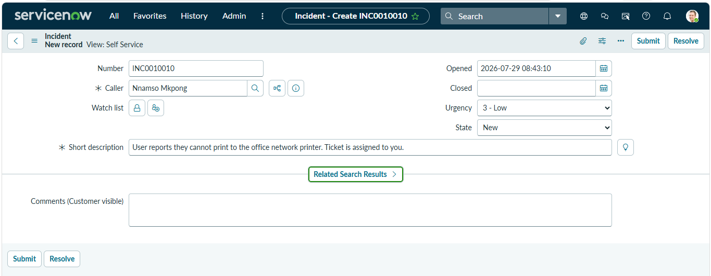
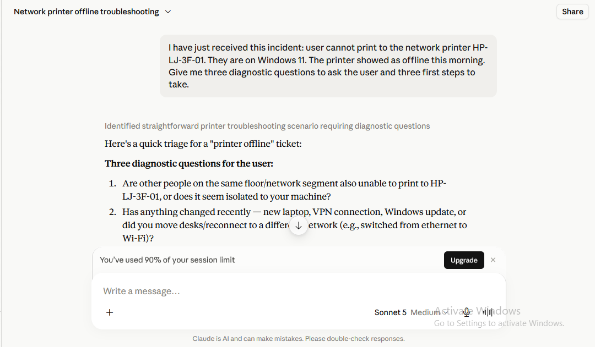
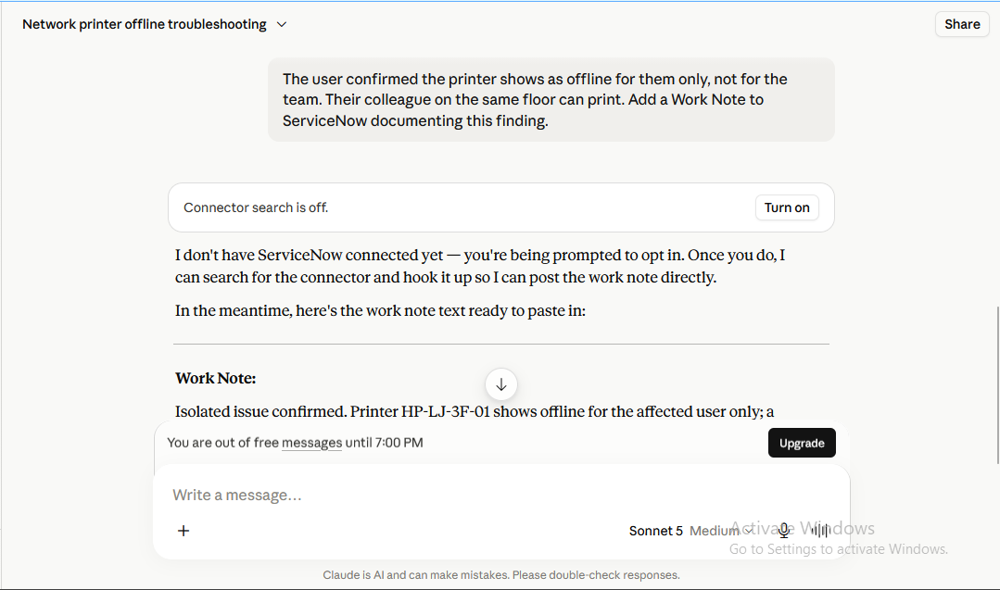
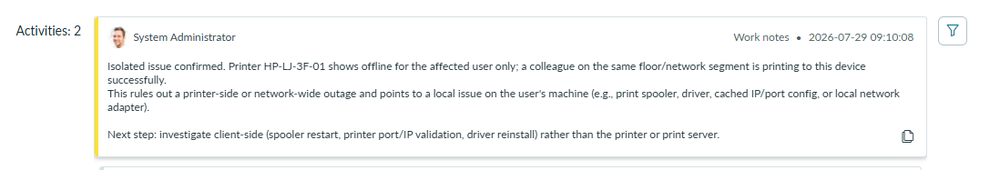
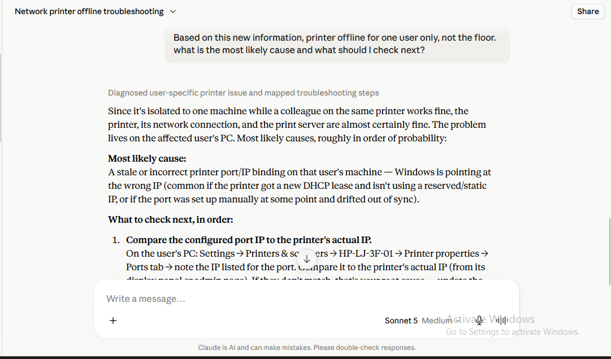
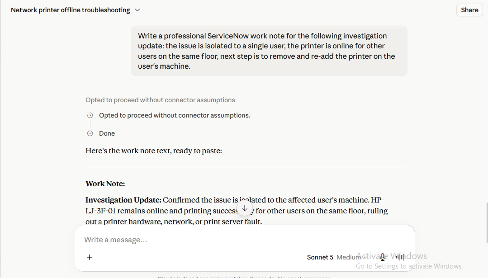
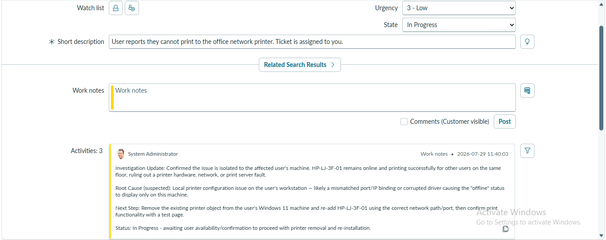
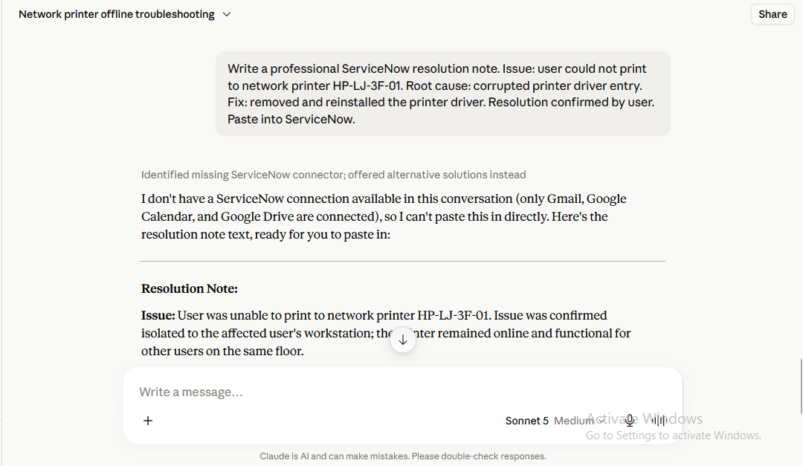
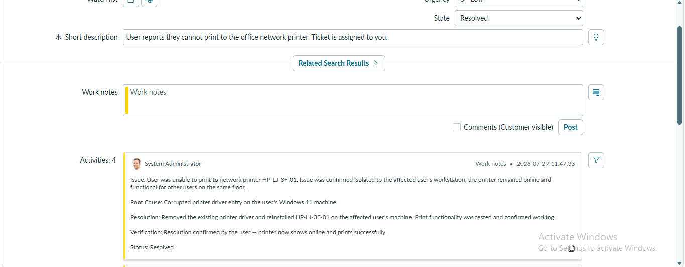

# AI Augmented ServiceNow Incident Workflow

> **Author:** Nnamso Mkpong
>
> **Track:** AI + ITSM Integration
>
> **Tools:** Claude + ServiceNow 
>
> **Priority:** High
>
> **Completed:** May 2026

---

## Objective

Work a live incident in ServiceNow while using Claude in a parallel browser window to assist with diagnosis, draft work notes, suggest next investigative steps, and generate the resolution note. This lab demonstrates a real world dual tool workflow that increases analyst throughput without replacing analyst judgment.

---

## Business Scenario

Our service desk has started allowing analysts to keep Claude open alongside ServiceNow during live calls. This repository documents a complete incident lifecycle, from first contact to closure, and shows exactly where AI added value and where the analyst stayed firmly in control. It is written as a training guide for a new analyst who is about to start using AI alongside ServiceNow for the first time.

---
## Tools Used

| Component | Detail |
|---|---|
| Platform | ServiceNow PDI |
| AI tool | Claude.ai, opened in a second browser tab |
| Workflow | Dual window: ServiceNow on the left, Claude on the right |
| Deliverable | This repository: dual tool workflow training guide |

---

## The Incident

**INC0010010** — User reports they cannot print to the office network printer, HP LJ 3F 01. Caller is on Windows 11. Printer showed as offline that morning.
---

## Step by Step

Each step below mirrors the actual sequence followed during the incident, with the analyst action, the Claude interaction, and the resulting screenshot shown together.

### Step 1: Create the incident in ServiceNow

A new incident, INC0010010, was logged for a user unable to print to the office network printer, HP LJ 3F 01. The ticket was left in the New state and assigned to the analyst.



---
### Step 2: Get diagnostic questions and first steps from Claude before the first call

Before touching the ticket further, the incident description was pasted into Claude to get a fast, structured starting point: three questions to ask the user and three first troubleshooting steps to try. This output guided the analyst's opening call rather than being pasted into the ticket.



---

### Step 3: Feed the user's answers back to Claude and request a work note

The user confirmed the printer was offline for them only, not for the rest of the floor. This finding was given to Claude with a request to turn it into a properly worded ServiceNow work note. Claude did not have a live ServiceNow connector active in this session, so it returned the drafted note as text for the analyst to paste in manually rather than posting it directly.



---
### Step 4: Post the work note and review the activity log

The drafted note was reviewed and pasted into the Work Notes field in ServiceNow, confirming the isolated user finding on the record.



---
### Step 5: Ask Claude for the most likely cause and next checks

With the fault confirmed as isolated to one machine, Claude was asked what the most likely cause was and what to check next. It returned a ranked, testable list: port/IP mismatch, spooler fault, and local network or profile issues, each with the exact Windows path or command needed to check it.



---
### Step 6: Ask Claude to draft the investigation update work note

Once the plan was set, next step, remove and re-add the printer on the user's machine, Claude was asked to write this up as a professional work note, including the suspected root cause and current status.



---
### Step 7: Post the update and move the ticket to In Progress

The drafted note was reviewed and posted, and the ticket state was changed from New to In Progress to reflect that active work was underway.



---
### Step 8: Perform the fix, then ask Claude to draft the resolution note

The printer was removed and re-added on the user's machine, and the fix was confirmed working. The issue, root cause, fix, and user confirmation were given to Claude with a request to draft a professional resolution note.



---
### Step 9: Post the resolution note and close the ticket

The resolution note was reviewed and posted, and the ticket state was changed to Resolved, completing the full AI assisted incident lifecycle with a clean activity log.



---
## Workflow Stages Documented

1. Triage and diagnostic questioning with AI
2. Follow up investigation, isolating the fault to a single user
3. AI assisted diagnosis of the most likely root cause
4. AI assisted work note drafting at each stage of the investigation
5. AI generated resolution note once the fix was confirmed
6. Ticket closure with a full activity log

See [prompt_logs.md](./prompt_logs.md) for every prompt sent to Claude and the full response received, without the screenshots embedded above. See [ticket_notes.md](./ticket_notes.md) for the exact text that was posted into ServiceNow at each stage. See [case_evaluations.md](./case_evaluations.md) for an evaluation of how well Claude performed at each step. See [workflow_diagram.md](./workflow_diagram.md) for a visual breakdown of who did what and when.

---
## Dual Tool Workflow at a Glance

```
ServiceNow                          Claude
-----------                         ------
Incident created (INC0010010)
       |
       v
                                     Diagnostic questions + first steps requested
                                     Analyst uses Claude's output to run the first call
       |
Work note posted (isolated to
one user, floor unaffected)   <----  Draft written in Claude, analyst reviewed and pasted in
       |
       v
State set to In Progress
                                     Root cause analysis requested from Claude
                                     Analyst validates the reasoning against the evidence
       |
Fix performed on user's
machine (printer removed
and re-added)
       |
Work note posted (investigation
update, next step confirmed)  <----  Draft written in Claude, analyst reviewed and pasted in
       |
Fix confirmed working by user
       |
Resolution note posted        <----  Draft written in Claude, analyst reviewed and pasted in
       |
State set to Resolved
```

Full ASCII and stage by stage breakdown is in [workflow_diagram.md](./workflow_diagram.md).

---
## Where AI Helps Most in a Live Incident

- **Opening triage.** The moment a ticket lands, Claude produced a ready to ask set of diagnostic questions and a prioritized set of first steps in seconds, instead of the analyst having to recall or look up a troubleshooting checklist. This shaved real time off the very first call.
- **Interpreting new evidence.** Once the user confirmed the fault was isolated to their machine, Claude reasoned through the likely cause (port or IP mismatch, spooler fault, corrupted driver) and gave a ranked, testable checklist. This is exactly the kind of pattern matching AI does well, and it kept the analyst from working through the full troubleshooting tree by hand.
- **Writing clean, consistent documentation.** Every work note and the resolution note were drafted by Claude in a clear, professional ServiceNow style. This is the single biggest time saver in the whole workflow: analysts often lose more time wording notes correctly than they do fixing the actual problem.
- **Keeping the ticket audit trail readable.** Because the notes were consistently structured (issue, root cause, next step, status), anyone picking up the ticket later can understand the investigation without re-reading the whole history.

---
## Where the Analyst Must Lead

- **Identity verification.** Claude never confirmed who the caller was. Verifying the user's identity before acting on the account or machine is a human control point and stays with the analyst.
- **Escalation judgment.** Claude can suggest a likely cause, but the decision to escalate to a second line team, treat the ticket as a wider outage, or keep working it solo is a judgment call informed by team workload, ticket priority, and business impact. AI does not have visibility into any of that context.
- **User communication tone.** The work notes Claude drafted were written for the ticket record, not for a nervous or frustrated end user on the phone. Reading the tone of the caller and deciding how to reassure them, when to apologize, and when to set expectations on timelines is squarely an analyst skill.
- **Confirming the fix actually worked.** Claude drafted the resolution note based on what the analyst told it. It was the analyst, not Claude, who performed the fix, tested it, and got user confirmation before closing. AI drafts the record, it does not perform or validate the technical action.
- **Final accountability.** Every note Claude drafted was reviewed before it was pasted into ServiceNow. The analyst remained the one accountable for the accuracy of the ticket record and the decisions taken on it.

---
## Measuring AI Impact in IT Support

Realistic, conservative time savings estimates per ticket type, based on the pattern demonstrated in this lab:

| Ticket type | Manual time (approx) | With AI assist (approx) | Estimated savings |
|---|---|---|---|
| Simple hardware/peripheral issue (this lab) | 12 to 15 minutes | 8 to 10 minutes | 30 to 35 percent |
| Password/account access request | 5 to 8 minutes | 4 to 6 minutes | 15 to 20 percent |
| Application error triage | 20 to 30 minutes | 14 to 20 minutes | 25 to 35 percent |
| Multi step network connectivity issue | 30 to 45 minutes | 20 to 30 minutes | 30 to 35 percent |
| Ticket documentation and closure (any type) | 5 to 7 minutes | 1 to 2 minutes | 60 to 75 percent |

The largest and most consistent saving is in documentation time, not diagnosis time. Diagnosis still needs the analyst to run tests and observe real behaviour, but writing the note that describes what happened is a task AI can do almost instantly once the analyst has fed it the facts.

---
## Outcome

A full incident lifecycle for INC0010010 was documented in ServiceNow with Claude assisted work notes and a Claude assisted resolution note. The ticket was moved from New, to In Progress, to Resolved, with a complete activity log. A dual tool workflow diagram and two sections covering where AI helps most and where the analyst must lead are published in this repository.

---
## What I Learned

1. AI is fastest and most reliable at the start (triage questions) and the end (documentation) of a ticket, and least reliable at replacing hands on verification in the middle.
2. Feeding Claude accurate, specific facts at each stage (what the user confirmed, what was tested) produced far more useful output than a vague prompt would have.
3. Drafted work notes still need a human read through before posting. Claude does not know internal ServiceNow conventions, team naming, or ticket specific context unless the analyst provides it.
4. Using Claude for documentation removes a surprising amount of daily friction. Wording a clear, professional note takes longer than most analysts realize, and AI closes that gap almost instantly.
5. The dual window workflow works best when Claude is treated as a second opinion and a drafting assistant, not as the decision maker. The analyst still owns the diagnosis, the fix, and the ticket.

---
## Real World Relevance

Dual tool AI workflows like this one are increasingly showing up in service desk team standards at enterprise organisations because they attack the two biggest hidden costs in IT support: inconsistent documentation and slow first response. Support teams are commonly measured on Mean Time to Resolution and on the quality of the ticket record left behind for audit and knowledge base purposes. A workflow where AI assists with triage questions and note drafting, while the analyst keeps full control of diagnosis, escalation, and user communication, directly improves both metrics without removing the human judgment that customers and auditors expect from a support desk. As more helpdesk platforms add native AI assist features, understanding how to work this way, and where to draw the line on what stays human led, is becoming a baseline skill for support analysts rather than an advanced one.

---
## Repository Contents

```
lab10_ai_servicenow_incident_workflow/
├── README.md                 This file, the training guide
├── prompt_logs.md            Every Claude prompt and full response, in order
├── ticket_notes.md           The exact text posted into ServiceNow at each stage
├── case_evaluations.md       Evaluation of Claude's performance at each step
├── workflow_diagram.md       Detailed dual tool workflow diagram
└── screenshots/              All supporting screenshots referenced across the docs
```
