# Lab 11: AI Assisted PowerShell Scripting for Active Directory Administration

**Track:** AI + Systems Administration | **Tools:** Claude + PowerShell + Active Directory | **Priority:** High

## Objective

Use Claude to generate, explain, and troubleshoot three practical PowerShell scripts for common Active Directory administration tasks, then run each script in a live lab environment and confirm the results. This lab demonstrates how an AI assistant can accelerate script writing while the analyst stays responsible for reviewing the code, running it safely, and validating the output before it is trusted.

## Business Scenario

A systems administrator is asked to build a small toolkit of repeatable PowerShell scripts for day to day Active Directory tasks: resetting a single user's password, finding stale accounts for a security review, and checking disk space across a set of machines. Rather than writing each script from scratch, Claude is used as a drafting assistant in a second window while PowerShell ISE runs on the lab machine. This repository documents that process end to end, from prompt to working script to verified output, and is written as a reference for a colleague who wants to use AI the same way.

## Tools Used

| Component | Detail |
|---|---|
| Platform | Windows lab environment with Active Directory Domain Services, PowerShell ISE |
| AI tool | Claude.ai, opened in a second browser window |
| Module | ActiveDirectory PowerShell module (RSAT) |
| Deliverable | This repository: three working scripts, prompt log, and verified output |

## Scripts Produced

| Script | Purpose |
|---|---|
| [Reset-ADUserPassword.ps1](./scripts/Reset-ADUserPassword.ps1) | Resets a single AD user's password to a temporary value and forces a change at next logon |
| [Export-InactiveADUsers.ps1](./scripts/Export-InactiveADUsers.ps1) | Exports all AD users who have not logged on in the last 90 days to a CSV file |
| [Check-DiskSpace.ps1](./scripts/Check-DiskSpace.ps1) | Reads a list of computer names and reports colour coded free disk space on the C drive of each |

## Step by Step

Each step below shows the analyst action, the Claude interaction where relevant, and the screenshot confirming the result.

### Task A: Reset a single Active Directory user's password

**Step 1: Ask Claude to draft the password reset script**

Claude was asked for a script that accepts a username as a parameter, sets a temporary password, forces a change at next logon, and includes error handling for a user not found scenario. Claude returned a complete, commented script and explained the usage, the specific exception it catches for a missing user, and the module requirement.

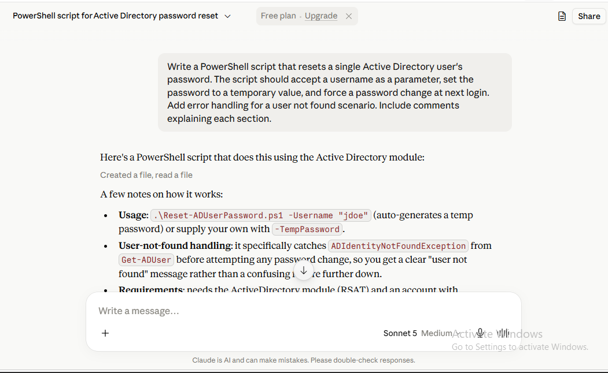

**Step 2: Download the script to the lab machine**

The generated script was downloaded as `Reset-ADUserPassword.ps1` onto the desktop of the lab machine, ready to run.

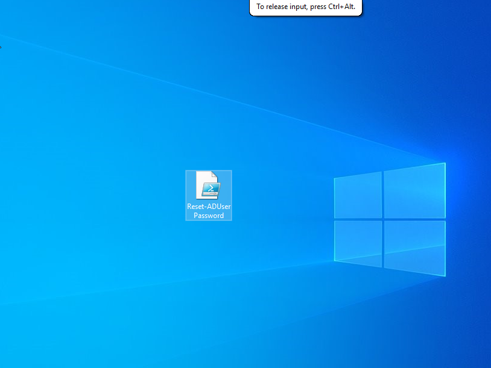

**Step 3: Open PowerShell ISE as Administrator**

PowerShell ISE was launched with Run as Administrator, since resetting an AD password requires elevated rights.

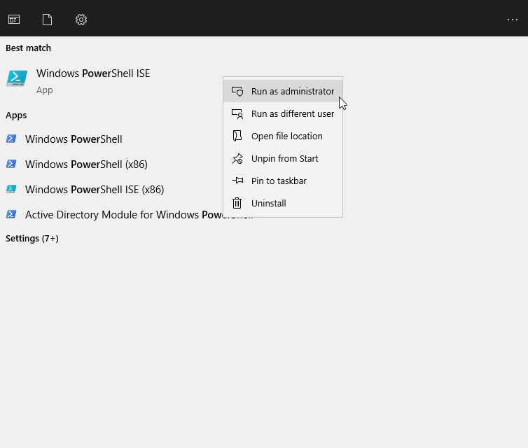

**Step 4: Confirm the target account in Active Directory Users and Computers**

Before running the script, the target test account, Jayson Sule, username Jayson419, was confirmed in Active Directory Users and Computers so the reset could be verified against a known account.

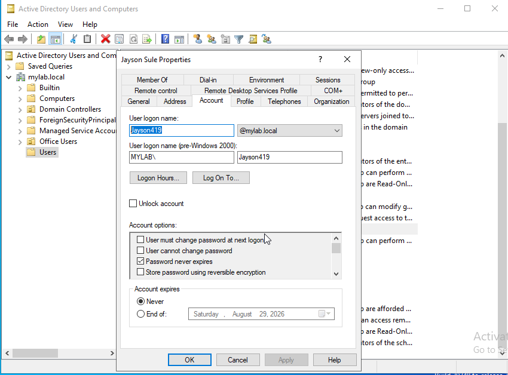

**Step 5: Navigate to the script directory and prepare to run it**

In PowerShell ISE, the working directory was changed to the desktop and the script was called against the target username, `.\Reset-ADUserPassword.ps1 -Username "Jayson419"`.

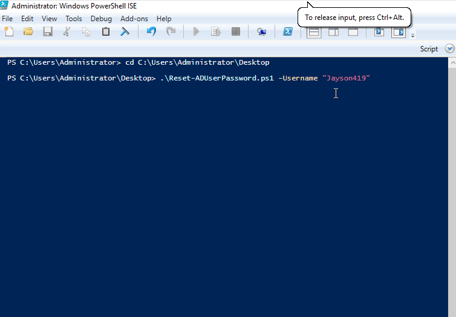

**Step 6: Run the script and confirm the password reset**

The script ran successfully, generated a temporary password, reset it on the account, and confirmed the user will be required to change it at next logon.

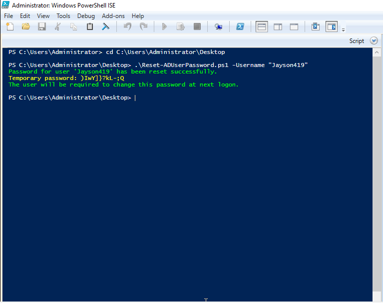

---

### Task B: Export inactive Active Directory users

**Step 7: Ask Claude to draft the inactive user export script**

Claude was asked for a script that exports all AD user accounts that have not logged in within the last 90 days to a CSV file called inactive-users.csv, including username, last logon date, department, and manager, with a line count at the end. Claude explained why it used the replicated LastLogonTimestamp attribute rather than LastLogon, and flagged the replication lag this introduces.

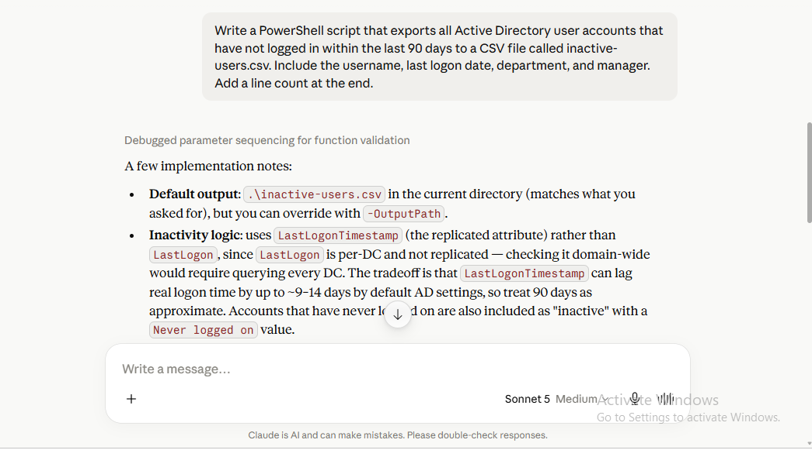

**Step 8: Download the script to the lab machine**

The generated script was downloaded as `Export-InactiveADUsers.ps1` onto the desktop.


**Step 9: Navigate to the directory and run the script**

The script was run from the desktop directory with no additional parameters, using its default 90 day threshold and default output path.

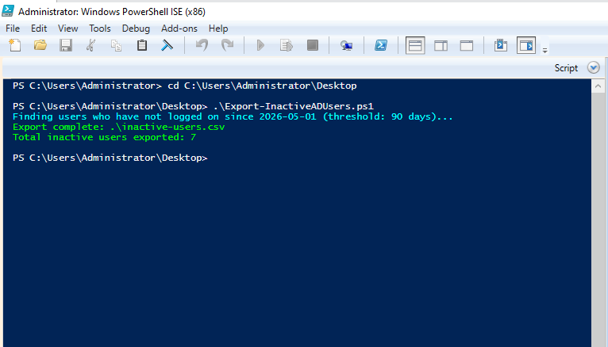

**Step 10: Review the exported CSV**

The script reported 7 inactive users exported and the resulting `inactive-users.csv` was opened to confirm the username, display name, last logon date, department, manager, and enabled status were captured correctly for each account.

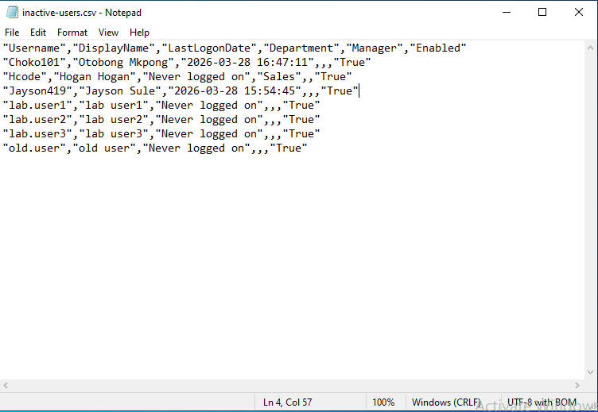

---

### Task C: Check disk space across a list of computers

**Step 11: Ask Claude to draft the disk space checking script**

Claude was asked for a script that reads a list of computer names from a text file, checks the free disk space on the C drive of each, and outputs a colour coded result in the console: red if below 10 GB, yellow if below 20 GB, green if above 20 GB. Claude explained the CIM based query method, the colour thresholds, and how unreachable machines are handled without being mistaken for a real low disk space reading.

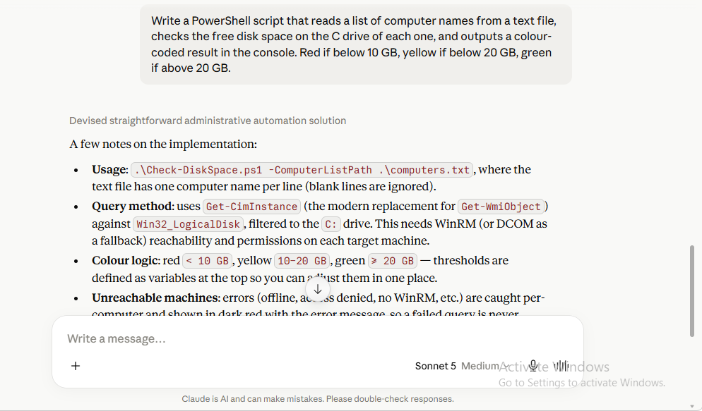

**Step 12: Create the computer list file before running the script**

Before running the script, a `computers.txt` file was created listing the machines to scan. In this lab environment, that list contained a single entry, `localhost`, to demonstrate the script against the local machine.

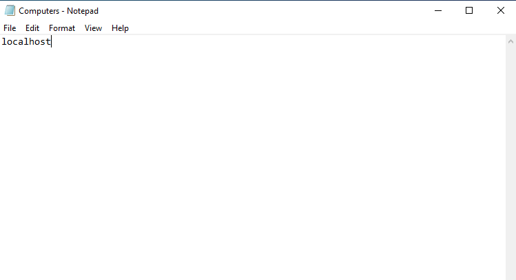

**Step 13: Navigate to the directory, run the script, and confirm success**

The script was run against the computer list and returned a colour coded result showing the local C drive with 41.07 GB free of 59.37 GB total, printed in green since it was above the 20 GB threshold.

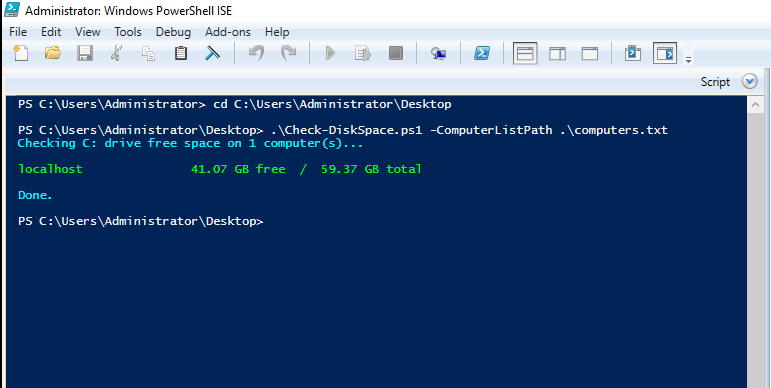

---

## Where AI Helps Most in This Workflow

- **First draft speed.** Each of the three scripts came back from Claude as a complete, working first draft in one prompt, already handling the specific edge case that was asked for (user not found, never logged on accounts, unreachable computers).
- **Explaining tradeoffs, not just writing code.** For the inactive users script, Claude did not just query an attribute, it explained why LastLogonTimestamp was chosen over LastLogon and what replication lag that introduces. That kind of reasoning is what turns a script into something an administrator can trust and explain to others.
- **Consistent commenting and structure.** All three scripts came back with clear section comments, comment based help, and parameter documentation, which is exactly the kind of detail that is easy to skip under time pressure but pays off the next time someone else has to read the script.
- **Sensible defaults with room to override.** Each script shipped with reasonable default behaviour (90 day threshold, default output path, generated temporary password) while still exposing parameters to override those defaults, which is good script design that Claude applied without being explicitly asked for it.

## Where the Analyst Must Lead

- **Reviewing the code before running it.** Every script was read through before execution, particularly the password reset script, since it performs a privileged, user affecting action. AI generated code that changes account state should never be run unread.
- **Running with the correct privileges and against the correct target.** Elevating to Administrator, confirming the target account in Active Directory Users and Computers first, and choosing a safe test target (a known lab account, and localhost for the disk space check) were all analyst decisions, not something the AI could verify.
- **Validating the output, not just the exit message.** A script printing a success message is not the same as confirming the result is correct. The CSV export was opened and manually checked, and the target account's properties were checked before and after the password reset, to confirm the script did what it claimed.
- **Handling the temporary password securely.** The script printed the generated temporary password to the console. Deciding how that password gets communicated to the real end user, and making sure it is not left visible in a shared or logged session, is an analyst responsibility that no script can enforce on its own.
- **Deciding when a script is safe to reuse against production.** These scripts were run in a lab environment against test accounts and localhost. Extending any of them to run against a live domain with real user accounts and real machines is a separate decision that requires its own review, approvals, and testing, not something to be inferred from a successful lab run.

## Measuring AI Impact in Script Development

Realistic, conservative time savings estimates for this kind of task, based on the pattern demonstrated in this lab:

| Task | Manual scripting time (approx) | With AI assist (approx) | Estimated savings |
|---|---|---|---|
| Single purpose script with basic error handling (password reset) | 30 to 45 minutes | 10 to 15 minutes | 60 to 70 percent |
| Script with AD query logic and CSV export (inactive users) | 45 to 60 minutes | 15 to 20 minutes | 60 to 70 percent |
| Script with remote query and conditional output logic (disk space) | 30 to 40 minutes | 10 to 15 minutes | 60 to 65 percent |
| Writing comment based help and parameter documentation (any script) | 10 to 15 minutes | 1 to 2 minutes | 80 to 85 percent |

As with the ServiceNow workflow in Lab 10, the largest saving shows up in the parts of the task that are about structure and documentation. The actual testing, privilege handling, and validation of results still took analyst time regardless of how the script was written.

## Outcome

All three scripts were generated with Claude, downloaded into the lab environment, reviewed, and run successfully. The password reset script was verified against a known lab account, the inactive users export was verified by opening the resulting CSV, and the disk space script was verified against a local target with correctly colour coded output.

## What I Learned

1. Claude produces genuinely usable first draft scripts for well scoped administrative tasks, especially when the prompt states the exact inputs, outputs, and edge cases needed.
2. Asking Claude to explain its choices, such as which AD attribute it queried and why, surfaces tradeoffs that are easy to miss when writing a script quickly by hand.
3. A script that runs without error is not automatically a script that is correct. Every result in this lab was checked against the source data (Active Directory Users and Computers, the exported CSV, the known local disk size) rather than trusted on the strength of a green success message.
4. Privileged scripts, like a password reset, deserve extra scrutiny before execution regardless of how clean the AI generated code looks.
5. Small, well scoped scripts are the sweet spot for this workflow. Each of these three scripts had one clear job, which made both the prompt and the review straightforward.

## Real World Relevance

Writing small, repeatable PowerShell scripts is a constant, low visibility part of systems administration work, and it is exactly the kind of task where AI assistance shows a clear, measurable time saving without removing the human judgment the role requires. An administrator still has to decide what the script should do, review it for safety before running it against real accounts or machines, and validate that the output is correct. What changes is how much time is spent on the mechanical parts of the task, boilerplate error handling, comment based help, and remembering the right cmdlet and attribute names, which is exactly the kind of overhead AI is well suited to absorb. As more IT teams adopt AI assisted scripting as a normal part of their toolkit, knowing how to prompt precisely, read the generated code critically, and verify results independently is becoming a baseline skill rather than a specialist one.

## Repository Contents

```
lab11_ai_powershell_ad_automation/
├── README.md                 This file, the training guide
├── prompt_logs.md            Every Claude prompt and full response, in order
├── script_logs.md            The exact console output and results from each script run
├── case_evaluations.md       Evaluation of Claude's performance at each step
├── workflow_diagram.md       Detailed dual tool workflow diagram
├── scripts/                  The three working PowerShell scripts
│   ├── Reset-ADUserPassword.ps1
│   ├── Export-InactiveADUsers.ps1
│   └── Check-DiskSpace.ps1
├── sample_output/            Verified output produced by the scripts
│   └── inactive-users.csv
└── screenshots/               All supporting screenshots referenced across the docs
```
